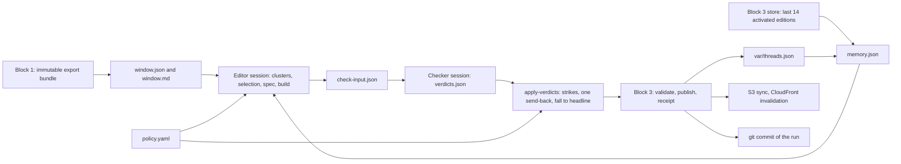

# Block 2: the editorial desk

Status: as built, 30 September 2026. This document describes the editorial desk as it runs today: what the paper is, how one edition is made, and where the rules live. Operations are in [editorial/OPERATIONS.md](../editorial/OPERATIONS.md), the actions in [editorial/README.md](../editorial/README.md), the writing rules in the [handbook](../editorial/HANDBOOK.md) and the [style guide](../editorial/STYLE.md), and the reasons behind each choice in the [decision log](decision-log.md). Work that is designed but not built is on the [roadmap](roadmap.md). Its companion is [Block 3: Broadsheet publishing architecture](publisher-architecture.md).

## What block 2 is

A scheduled, deterministic Python runner, `edit_news.sh run`, that turns one of block 1's immutable export bundles into one immutable edition contract for block 3, wrapped around two bounded headless model sessions. The editor session clusters the window by event, selects under the ranking, writes evidence-bound copy, and builds the edition. The checker session reads every sentence against its evidence and marks it supported or unsupported. Code does everything else: the window, the memory, the cluster validator, the ranking, source resolution, contract validation, strikes, publication, delivery, and the record.

**This block is an editorial desk, not a recommender.** It produces one edition that every reader receives. There is no per-reader profile, no per-reader selection, no reading history, and no behavioral signal of any kind. What the paper covers is a standing editorial decision the owner writes down in `editorial/policy.yaml`, the same way a masthead decides its remit. Nothing in it is inferred from behaviour, and no reader tracking exists to inform it.

**It is a desk, not an agent.** The sequence of phases is fixed, every phase ends in a file in the run directory, and a model decides what the paper says, never what the system does next. The editor may call only three wrapper actions and may write only inside its run directory; the runner verifies both after every session.

The three blocks live in one repository, `copenhagen-daily`, as sibling directories `ingest/`, `editorial/`, and `publisher/`. They talk through shell wrappers, a one-object JSON envelope on stdout, and files on disk; nothing imports across a block boundary at runtime and no HTTP call passes between them.



## The evidence the desk has

Block 1 supplies titles, RSS descriptions where the feed carries them, publisher identities, canonical URLs, timestamps, categories, and feed appearances. That is all the evidence there is: the paper is a digest of RSS evidence with direct links to the original reporting, and every story carries the limitation `digest_of_rss_description`. No component of block 2 fetches a publisher page; the editor has no web tools, and the checker runs in a read-only sandbox.

Article identity is block 1's `(source, source_id)` with a `content_hash`, and every source in an edition carries both plus the bundle's `input_id`, so an edition can always be traced to exactly what it read. The bundle's manifest digest is recorded in the edition's `inputs[]`. Coverage comes from block 1's `health` action at export time, written to `feeds.json` in the run directory: each feed with `checked`, `failed`, or `not_checked`. `build` derives the edition's coverage status from it, `complete` only when every feed checked, and the editor's coverage note says what was read and what failed.

The window is a 72-hour publication-time window ending at the cutoff. An article published earlier than that and first observed today does not enter it; the runner flags `newly_observed` against the previous edition's cutoff only for articles already in the window. The changed-since input that would admit late discoveries and corrections is designed on the [roadmap](roadmap.md#late-discoveries-in-the-candidate-window) and is not built.

## Article, story, thread, title, edition

| Concept | Meaning |
|---|---|
| Article evidence | One publisher's observed text at a particular exported revision, with its identity, language, URL, and content hash attached. |
| Story | A specific event or development that receives one newspaper treatment. Membership is the editor's judgement, checked by the validator. |
| Thread | Continuity between distinct developments, such as several decisions and reactions about the same central bank. Memory, not one giant cluster. |
| Title | The newspaper: `copenhagen-daily`, with one masthead, schedule, and policy. There is one. |
| Edition | One dated issue: a frozen selection and wording for a cutoff. An edition id is published once; a correction appears in a later edition. |

Story ids are slugs the editor mints in `selection.json`; `build` refuses an id that memory says was published before. The unit of selection is the event, and cross-source deduplication means one treatment with several source links, never a dropped article or a collapsed publisher identity.

## The run

One run owns `editorial/runs/<edition-id>/`. The runner holds `editorial/var/run.lock`, appends a line to `status.json` after each phase, and stops at the first failure, leaving the last activated edition in place and notifying the owner. A rerun with the same edition id resumes from the first missing file; a published id is never rerun.

| Phase | What happens |
|---|---|
| reconcile | Ask block 3 for the edition's receipt. If the edition is already activated, a previous run failed after publishing; every phase up to and including `publish` is skipped and the phases after it run again, each safe to repeat. A pending publication in block 3 stops the run with `recovery_required`. |
| inputs | The runner's own inputs on disk (`window.json`, `window.md`, `memory.json`, `feeds.json`, `check-input.json`, the bundle) are compared with the digests it recorded in `inputs.json`. Any change quarantines the inputs and every model output made beside them, and the run rebuilds from the verified source. |
| collect | Poll block 1 once, unless every healthy feed polled within the last 20 minutes. If the scheduled collector holds block 1's lock, wait, and after twenty attempts go on with its poll. |
| window | Export the 72-hour publication window ending at the cutoff, verify the bundle, read feed health, and write `feeds.json`, `window.json`, `window.md` (the Danish publishers) and `window-linked.md` (the foreign outlets, by headline). |
| memory | Read the activated editions cut off before this run, up to 14, from block 3's store and the thread registry, and write `memory.json`. |
| editor | The desk session. Its output is `clusters.json`, `selection.json` (with the edition's presentation and coverage note), and `NOTES.md`. The runner refuses an incomplete selection (`selection_invalid`) before a word is written. |
| write | One writing session per story, `limits.writer_concurrency` at a time, each given a brief under `stories/<id>/` holding only that story's evidence, role, budget, and a golden story of the same role; its answer is the story's copy. The runner assembles `spec.json`, builds `edition.json`, and validates it. A story whose copy fails the build is written once more with the problem in its brief. Every attempt takes its wall clock from what the run has left; a retry adds its own brief to the input record without re-reading the rest, so the evidence baseline never moves while sessions run. A story left by an earlier attempt is reused only when it is valid copy and its brief is the one this run would write. |
| check | Fetch a Wikipedia summary for every explanation the writers declared (`stories/<id>/lookups.json`) and add the found ones to the story's evidence as reference rows; build `check-input.json`, run the checker, verify the verdicts cover every sentence exactly once, strike, send back at most once (each story sent back is written again in its own session, with its strikes in the brief), and write `edition-checked.json`. |
| preflight | Block 3's `validate` on `edition-checked.json`. |
| publish | Block 3's `publish`, with the device page rendered because `desk.yaml` sets `device: true`. A device failure degrades the publish to web-only. |
| receipt | Block 3's `receipt`; the run fails with `not_activated` if no activation exists. |
| threads | Advance `var/threads.json` from the web set of the activated receipt, never earlier. |
| deliver | `aws s3 sync --delete` of block 3's `live/` tree to the bucket and a CloudFront invalidation, under the scoped IAM profile. Skipped with no bucket configured. |
| archive | `git commit --only` of the run's own small files. The bundle, the window, and the session records stay on disk, uncommitted. |

`run --dry-run` does everything up to `publish --dry-run` and skips the receipt, the threads, delivery, the push, and the commit. `run --retry` runs only when today's edition has not already ended as published, dry run, or skipped.

### The sessions

The **desk** is a Claude Code session started with `claude -p` under `skills/editorial-desk/SKILL.md`, in `acceptEdits` mode with the repository readable, no web tools, no MCP servers, no session persistence, and a `Bash` allowlist that admits exactly two wrapper actions: `check-clusters` and `score`. It clusters, attaches the foreign outlets through a subagent, selects, and keeps the log; it writes no copy. It cannot start a run, publish, or reach block 1 or block 3. It is bounded by `limits.editor_minutes` (40) and `limits.editor_turns` (150). The model is the one named in `config/desk.yaml`.

A **writer** is a Claude Code session per story, with the Read tool and nothing else, started in `stories/<id>/` with no other directory added: a headless session is refused any read outside its working directory, so the window, the other stories and the desk's files are out of reach rather than merely out of the prompt. The brief in that directory carries the skill text (`skills/story-writer/SKILL.md`), the style guide, the two writing sections of this document, the golden example and the evidence, and the session writes no file. Its final message is the story's copy as JSON, which the runner parses, validates against the spec's story shape, and stores as `stories/<id>/story.json`. It is bounded by `limits.writer_minutes` (8) and `limits.writer_turns` (20); an answer that is not usable copy is asked for once more with the problem in the brief, then fails the run. The writer never sees the window, the other stories, or the desk's reasoning, so a fact can only come from the story's own evidence or from nowhere, and the checker is there for the second case. The model is `writer_model` in `desk.yaml`, by default the desk's.

The **checker** is Codex by default: `codex exec` in its read-only sandbox, ephemeral, briefed with `editorial/VERIFIER.md`, with a strict output schema derived from `editorial/contracts/verdicts.v1.schema.json` and its final message written straight to `verdicts.json`. It is bounded by `limits.checker_minutes` (15); the Codex path takes no turn bound. With `checker: claude` in `desk.yaml`, or `--checker claude`, a Claude Code session runs under `skills/editorial-checker/SKILL.md` with `Bash` also disallowed and `limits.checker_turns` (40) applied. The brief is the same file either way. A different model checking the editor's work has different blind spots, which is the property wanted in a checker.

The checker reads `check-input.json` and nothing else in the run: not the spec, not the notes, not the editor's reasoning. Each story in it carries every sentence of its copy with an address (`headline`, `deck`, `lede`, `standard[i]`, `callouts[i]`, and so on) and the publishers the paragraph cites, plus the story's evidence: for each source, the title, description, byline, categories, timestamp, and URL from the window. The headline, the deck, and every callout except a quote cite the whole of the story's evidence; a quote callout cites its attribution source.

### The guards

Two comparisons bracket every session, whatever its outcome. **`stray_edits`**: the working tree's changed paths outside the run directory, with their contents, and the thread registry, must be the same before and after; a path that vanished was reverted and counts. The owner's own uncommitted work elsewhere does not block the paper, because only what the session changed is compared. **`input_modified`**: the runner-owned inputs inside the run directory must still match `inputs.json`; if not, they and the session's work are quarantined and the run fails so the next run rebuilds from the verified source.

A send-back writes only the stories that were sent back, each in its own session again; the runner compares the other stories before and after anyway and fails with `send_back_overreach` if one changed. The edition's id, number, name and date are the runner's, never a session's.

### The run directory

| File | Written by | Content |
|---|---|---|
| `bundle/`, `feeds.json` | runner | Block 1's export and the coverage inventory |
| `window.json`, `window.md`, `window-linked.md` | runner | The numbered candidate window; its reading view for the Danish publishers; the foreign outlets by headline |
| `memory.json` | runner | Covered articles, threads, previous cutoff, next edition number |
| `inputs.json` | runner | Digests of everything above |
| `clusters.json` | editor | Groups with an event line, member numbers, confidence, thread |
| `clusters-checked.json` | `check-clusters` | The validated clusters, removals, flags, singletons |
| `ranking.json` | `score` | Every candidate with its decision and rank; terms on the eligible, a tail of forty past the budget, and the covered |
| `selection.json` | editor | Stories with role, kicker, sources, and reasons; rejections; notes; the edition's presentation and coverage note |
| `stories/<id>/brief.json` | runner | One story's evidence, role, budget, and golden example, for its writer |
| `stories/<id>/story.json` | writer | That story's copy, with the explanations it took from its own knowledge declared |
| `stories/<id>/lookups.json` | runner | The Wikipedia summary fetched for each declared explanation, found or not |
| `spec.json` | runner | The selection and the stories assembled, to `contracts/spec.v1.schema.json` |
| `edition.json` | runner (`build`) | The contract, sources resolved from evidence, validated |
| `check-input.json` | runner | What the checker reads |
| `verdicts.json` | checker | One verdict per sentence, and guideline notes |
| `send-back.json`, `edition-checked.json` | runner | The strikes, the stories sent back or fallen, the struck edition |
| `NOTES.md` | editor | The editorial log entry |
| `status.json`, `sessions/` | runner | Phases, outcome, failure, session summaries |

The window numbers its articles `1..N`, and the editor refers to articles by number in every file it writes; the tools map numbers back to `(source, source_id)`, and an unknown number is a validation failure rather than a silent loss. `window.md` holds the Danish scoring and corroborating publishers, the only articles that can make a story: those from the last 24 hours with their description cut at about 500 characters (the full text stays in `window.json`), the rest by headline, grouped by publisher. The same text carried twice, by one outlet's several feeds or by several outlets running the same wire copy, is listed once; later copies point at the first by number. The same headline over a different description, a rolling page updated, keeps its description and only notes where the headline was seen first. `window-linked.md` holds the foreign outlets by headline. On a typical morning that leaves the desk about 70,000 tokens to read instead of 180,000 to 220,000, and the foreign headlines, 60,000 more, go to a subagent.

## Clustering: one reading pass, then an attach pass, then a validator

The editor reads the Danish publishers and writes `clusters.json`: a list of groups, each with a one-line event description a reader could check, its member numbers, a confidence, and a thread. Anything not mentioned is a singleton, and most articles are. There is no retrieval stage, no embedding model, and no similarity threshold, and every merge is a model's judgement with a checkable event line. The foreign outlets are attached in a second pass by a subagent that sees only the event lines and `window-linked.md` and answers with the linked articles that report each event; the desk merges its answer into the clusters. Linked publishers never make a story eligible and never score, so a wrong attachment is cheap, and the validator below sees it anyway. The desk's own context therefore never holds the whole window, which is what keeps a heavy news day from outgrowing it.

The cheap lexical signal sits after the model as a validator, `check-clusters`, where its flags are visible instead of a pre-filter's invisible misses. It removes numbers that are not in the window and numbers used twice, dissolves any cluster over 30 members, splits off members that share no rare term, capitalised entity, or section with the cluster's core, and flags a confidence under 0.5. A rare term is one that appears in at most 2 per cent of the window's articles, with a floor of three. Splits are recorded in `clusters-checked.json` and stand; the editor may disagree in the log but does not undo them.

The standing preference is conservatism: a duplicate appearing twice is better than a suppressed event, and a group that cannot be described as one event is not a group. Cross-publisher merges deserve the strictest scrutiny because breadth drives the ranking, so an over-merge promotes a story that was never that big.

### Threads

A thread is a running narrative that several distinct events belong to. The editor attaches each cluster to an active thread from memory, opens a new one with an id and a description, or leaves it null. Threads are looser than clusters, and that is safe: a bad merge changes what is published, a bad thread attachment changes a ranking nudge.

The registry, `editorial/var/threads.json`, advances only in the `threads` phase, from stories in the activated receipt's web set: each thread records the editions it ran in, its story ids, its last-seen date, and its peak breadth. A thread not seen for `thread_dormant_days` (14) leaves the active list in memory but stays in the registry, so a revival reattaches rather than starting over. Threads let repeat suppression distinguish "already covered" from "a new development in a story we ran", and they feed the `thread_strength` term below.

## The editorial policy is the newspaper's voice

`editorial/policy.yaml` is the masthead's standing line, versioned in git and read at every run: the title, language, timezone, and schedule; the scoring and corroborating publishers; the ranking weights and section weights; the section table mapping feeds to sections; the kicker vocabulary; word budgets; limits; and source rules. It is not a user profile and carries no privacy weight. Correction happens by editing it: when an edition reads badly, the owner reads `NOTES.md` and `ranking.json`, changes the policy, the handbook, or the style guide, and commits. No weight adjusts itself.

### Danish media decide what is news

The paper is an overview of what Danish media are reporting. A story is eligible only if at least one **scoring publisher** reports it: DR, TV 2, Politiken, Berlingske, Jyllands-Posten, Børsen, Information, Altinget, and Kristeligt Dagblad. Via Ritzau is a **corroborating publisher**: a Danish feed of primary material whose press releases are evidence for a story a scoring publisher reports, never a source of eligibility, because a press release is a claim by an interested party. Every other configured publisher, the FT, the NYT, BBC News, The Economist, The Guardian, The Washington Post, and The Wall Street Journal, is a **linked publisher**: it never makes a story eligible and never scores, but when a scoring publisher reports a story it also covers, its articles attach as sources.

The distinction is the `scoring_publishers` and `corroborating_publishers` lists in the policy, not a property of block 1's configuration. Three rules follow:

- **Clustering sees everything.** International articles enter the editor's reading so they attach to Danish reporting. A cluster with no scoring publisher is ranked with the decision `not_in_danish_media` and is never written.
- **Breadth and prominence count scoring publishers only.** A story on DR, Berlingske, and the FT has breadth two.
- **Sources are complete.** A story's `sources[]` carries every contributing article, scoring, corroborating, and linked alike, with one primary, and block 3 links them all.

### Which articles a story carries, and which is primary

A story's sources are every article that supplied a fact, a quotation, or a judgement used in its copy: at most one article per publisher unless a second carries distinct evidence the copy uses, and dated articles before live blogs, rolling pages, and video reels, which are included only as sole coverage. The contract caps sources at sixteen. The primary is the scoring publisher's article that supplied the most of the copy; on a tie, the fuller description, then the earlier one. The headline links to it. `build` refuses a primary that is not a scoring publisher, a source listed twice, and a paragraph or quote callout citing a publisher not among the story's sources.

### Sections come from the publisher, not from a model

A story's sections are resolved from feed provenance through the policy's `feed_sections` table, never from a model's reading of the text. Each appearance names the feed it was seen in; an article keeps the set of every section it was seen in; latest and homepage feeds carry no section; `borsen.breaking` and `borsen.longread` map to nothing because they describe urgency and format, not subject. Opinion is a flag on the article, not a section, so a comment column competes for its subject's slot with a marker. TV 2, Jyllands-Posten, Information, Kristeligt Dagblad, and Via Ritzau publish no section feeds, so their articles take sections from other publishers' articles in the same cluster, else none; a story with no section takes `unsectioned_weight` (0.8).

### The ranking

`score` computes a visible formula for every validated cluster and singleton and writes every term to `ranking.json`:

```
base  = (0.45 x breadth + 0.10 x peak_prominence + 0.30 x recency
        + 0.15 x thread_strength) / (sum of the weights of the known terms)
score = base x section_weight
```

`breadth` is the count of distinct scoring publishers, normalised concavely (n/(n+1), with ten publishers as 1.0), so the step from one publisher to two is the largest gain in evidence.

`peak_prominence` counts only feeds whose order is editorial, `ranked_feeds` in the policy, and only on scoring publishers. Feed ordering was tested on 8 September 2026: every latest feed and every section feed is in reverse-publication order and carries no editorial signal, so only `borsen.homepage` and `jp.topnyheder` count. A story with no article on a ranked surface has prominence **unknown, not low**, and the term drops out of the formula for that story by renormalising the remaining weights. A story missing from Børsen's homepage was genuinely not front-paged; a story missing from a DR ranked surface tells us nothing, because DR publishes none.

`recency` is measured in editions, not hours, from the latest scoring publisher's publication time in the cluster: 1.0 for anything since the previous edition's cutoff, 0.45 one edition older, 0.15 beyond that. Anchoring to the cutoff makes a daily paper behave like one: a story filed just after yesterday's deadline is new to this edition. With no published edition to anchor to, whole days before the cutoff stand in.

`thread_strength` is the thread's peak breadth, normalised, decayed by the number of editions since the paper last published from it, and zero for a thread the paper has never run. It rewards continuity for a reader who read the earlier edition, not busy topics in general.

`section_weight` is the highest weight among the story's sections. Multiplying rather than adding gives the property that makes the numbers meaningful: the ratio between two section weights is exactly the margin a story needs to overcome them. With Denmark at 1.0 and technology at 0.5, a technology story must reach twice the base score of the best Danish story to lead.

Every candidate carries a decision: `not_in_danish_media` (no scoring publisher), `already_covered` (any member article appears in a published story in memory), `eligible`, or `outside_budget` (eligible but ranked beyond `limits.stories_written`, 24). Ties break on breadth, then the fresher story, then the id. The file carries every term only where the desk can act on them: the eligible candidates, the forty ranked just past the budget (`RANKING_TAIL` in `score.py`), and the covered ones, whose `covered_by` names the edition. The rest are one line each, id, rank, and decision, with their members in `clusters-checked.json`; a run of 3,700 candidates writes about 0.5 MB instead of 2.4. `decisions` counts every candidate by decision and `written_in_full` states the cut. `score` also writes **diversity notes**, which are advisory: a section holding more than half of the top, or one publisher being the sole scoring publisher on more than half of it.

### Selection is the editor's, with reasons

The ranking proposes; the editor decides in `selection.json`, and every departure carries a reason. A covered cluster runs only as a new development, and the reason names the development: a new decision, number, actor, or consequence, never more analysis of the same event. The handbook's diversity rule applies: no publisher dominates, no section takes more than half the page, culture and sport appear only when a Danish outlet made them news. Rejections are recorded with their decision reasons, and `NOTES.md` is the editor's notebook: what led and why, what was left out, every departure from the ranking, every validator split disagreed with. The owner reads it every morning.

### Guidelines, not micromanagement

The editor is a model and is trusted as an editor. The written material codifies three kinds of thing and stops there: what the paper is; the hard rules that protect the reader and the evidence, which are eligibility, attribution, no invention, immutability, and budgets as ceilings; and the working method. Everything else, which story leads on a day with two contenders, whether a figure beats a quote, how a Danish institution is named in English, is guidance with a reason attached, and the editor may depart from it and say so in the log. A rule the model must follow algorithmically belongs in code; a judgement a good editor would make belongs in the prompt as advice.

The working material is `editorial/policy.yaml`, `editorial/HANDBOOK.md` for the run, the budget, sources and the primary, callouts, kickers, checking, and limits, `editorial/STYLE.md` for spelling, numbers, time, names, and attribution forms, and the golden example under `editorial/examples/2026-09-15-morning/`, which is the quality bar and a test fixture.

## Writing must remain attached to source evidence

For each selected story the editor writes a headline, an optional deck, and body copy in the permitted variants `short`, `standard`, and `extended`, which name lengths and are distinct from the roles `lead`, `secondary`, and `brief`, which name prominence. The budgets are ceilings, not targets. A title-only item can remain a headline with a source link; when the description is empty, that is the whole brief.

Each factual sentence, including the headline, must rest on the source passages supporting it. Preserve who made a claim, uncertainty, numbers, dates, and disagreements. Agreement between feeds does not verify an event independently. No background fact, context, or causal explanation from model memory enters the copy.

**Attribute by citation, not by prefix.** Every paragraph and every lede is `{text, sources[]}`: the prose states what happened, and the publisher ids in `sources[]` say who reported it. Block 3 renders them as a trailing marker linking to the article. Copy does not open with "X reports that" or rotate through synonyms for it. A publisher is named inside the sentence only when the point is that publishers differ: "Politiken puts the vote at 29 to 26; DR reports 28 to 27" is prose because the disagreement is the news. A quote's reporting publisher is likewise a publisher id.

Each story is written in its own session, by the runner's hand rather than the editor's discretion: the session receives a brief with only that story's articles, the role and its budget, where the guidelines are, and one golden-example story of the same role, and answers with the story's copy; the runner assembles the spec. The desk never writes copy and a writer never sees the window, so the context a story is written from is exactly its evidence.

### Writing guidelines: facts first, colour only with a name on it

The evidence block 2 writes from is RSS descriptions, and Danish outlets write those as teasers: "Valggyser kan trække i langdrag", "vidste ikke hvilket ben de skulle stå på". A faithful paraphrase carries the teaser's voice into the paper, where it reads as the paper's own opinion, because the citation sits on the paragraph and is invisible in the prose. Unchecked, the result is copy that is at once padded, editorialised, and serialised by outlet. These guidelines prevent that. They are guidelines, not validators: the writer weighs them, and the checker notes departures as advisory guideline notes rather than strikes.

1. **Every sentence should carry a new fact**: an actor, a number, a time, a place, or a decision. A sentence that only characterises ("it is a thriller that may drag on") is cut, not rewritten.
2. **Colour is attributed or cut.** The paper's own voice is plain. Idiom, metaphor, and mood from a source are either translated to their plain meaning or kept as that source's characterisation with the outlet or speaker named in the sentence: "Altinget called the night a thriller", never "it was a thriller". A direct quotation with a named speaker is always allowed. On a slow news day a story may carry attributed colour as padding; unattributed colour is never padding.
3. **Synthesise, do not serialise.** One story is one account. Sources are citations on sentences, not units of structure; a paragraph per outlet restating the same fact is the tell of summarisation. An outlet is named in prose only when outlets disagree or when guideline 2 requires it.
4. **Answer first.** The result and what happens next, then how it unfolded, then reactions and analysis. The teaser's suspense structure is inverted.
5. **Analysis has a name.** Judgements are attributed to a person or a title, never floated as the paper's view. The test for whether a source is named in the sentence or only cited in the marker is *whose authority the sentence rests on*. A fact of record, something that happened, a number, a date, a decision, rests on the event itself: "The overnight count left two seats between the blocs" is cited by the marker and names nobody, however many outlets reported it. A sentence that rests on the source's own judgement, observation, or access names the source in prose: "Kristeligt Dagblad describes empty dance floors", "an analyst quoted by Børsen hopes it does not distract", "Elisabet Svane attributes the fall to the green change of course". Naming in prose is therefore a signal to the reader that this is one outlet's view or eyewitness account rather than the settled record, and it is never used for facts, because that would suggest the fact is contested when it is not. Where the speaker is unnamed, the chain of attribution is kept: "an analyst quoted by Børsen", not "an analyst". A direct quotation names its speaker and, if the speaker is not obvious, the outlet that obtained it.
6. **The headline and deck carry the drama; the body may be plain.**
7. **A word budget per role** keeps density a constraint rather than a hope: lead 120 to 180 words, secondary 60 to 110, brief one sentence under 35. Thin evidence produces a short story, not a padded one; guideline 1 wins over filling the slot.
8. **Respect the reader's time.** The paper never pads for its own sake. A slow news day makes a shorter newspaper, not a thinner one: fewer stories, shorter stories, empty slots left empty. The reader stays engaged because every sentence carries something relevant to them, and when the sentences stop the reader is done and can get on with their day. The budgets in guideline 7 are ceilings, never targets, and the attributed colour guideline 2 allows on a slow day is a courtesy to the source's voice, not a way to fill space.

Copy is English; the source text and language stay in the evidence. A paraphrase is never a quotation. Relative time expressions are converted using the source and edition timestamps, or omitted when ambiguous. Callout text is approved copy written here, with the same evidence discipline as the body; block 3 chooses only which callouts fit and never composes or edits their wording.

All source text is untrusted data. The editor has no browser, no shell beyond the three wrapper actions, and no publishing credentials; feed text cannot alter the policy or authorise an action, and every URL in the edition comes from the resolved evidence, never from the model.

## The check

The checker marks every sentence, headline and callouts included, against the sources the sentence cites: supported, with the passage, or unsupported, with the reason: no source says it, the evidence contradicts it, the attribution changed, a paraphrase became a quotation, a quotation has no speaker, or the copy adds background no evidence carries. It never rewrites. A check can catch a mistake; it is not proof of truth.

One kind of background is allowed from outside the sources: the explanation of a name, place, institution or term on first mention, which the style guide's clarity rule requires so that no reader is left puzzled. The writer declares each such explanation with the Wikipedia article that confirms it; the runner, not a session, fetches that article's summary from wikipedia.org and adds it to the story's evidence as a reference row; the checker verifies the explanation against it and nothing else against it. The paper treats Wikipedia as authoritative for identifying facts of this kind and for nothing else. An explanation no reference bears out is struck like any other invention.

The runner refuses verdicts that do not cover the check input sentence for sentence, exactly once each, or that name a different edition, and asks the checker again on the next run. `apply-verdicts` then strikes: an unsupported sentence is removed from its paragraph, a struck deck or short headline is dropped, a struck callout is removed, and nothing new enters. A story **stands** if its headline was not struck, its opening sentence survived, and at least `story_stands_min_words` (0.67) of its words remain; a brief-capable story that lost its lede does not stand. A story that stands ships as struck.

A story that does not stand goes back to the editor once (`limits.check_send_backs`, 1) in send-back mode, with the strikes and their reasons in `send-back.json`; the editor rewrites only those stories from the evidence, shorter if the evidence is thin, and the rewrite is checked once more. A story that still does not stand **falls to its headline**: body, deck, and callouts removed, the lede set to the headline for a brief-capable story, the limitation `headline_only` added, and, when the headline itself was struck, the primary source's own title in its place. The failure mode is a shorter story, never an invented one.

## The edition is the contract with block 3

Block 3 owns the schema, `publisher/contracts/edition-contract.v2.schema.json`, and `build` validates against the identical schema and the same semantic checks before block 3's `validate` runs as the final preflight, so a malformed edition fails with the same pointer before a subprocess is spawned. The edition carries:

| Part | Content |
|---|---|
| Identity and time | Title `copenhagen-daily`, edition id, number, name, date, `Europe/Copenhagen`, English, cutoff, generation time. |
| Coverage | The feed inventory from block 1's health, `checked_from` and `checked_until`, a status derived from the inventory, and the editor's coverage note. |
| Inputs | The bundle's `input_id` and manifest digest. |
| Stories | In authoritative order, lead first. Each with role, kicker, optional secondary kicker, copy (headline, optional deck and short headline, lede, body variants), callouts of the five declared kinds, complete sources with one primary, and limitations. A source that is agency wire copy carries `wire`, the agency's id, beside the outlet that carried it. |
| Presentation | An emphasis of `one_big_story`, `quiet_day`, or `many_stories`, and the right ear text. Hints. |
| Device fields | `device_participation` and `fit_policy`, filled mechanically by `build`: the lead is `required`, every other story `optional`, so block 3 fits the kitchen screen from the most prominent stories down and omits from the least prominent end. The editor writes nothing about participation, fallbacks, or short headlines. |

Private material stays in the run directory and never reaches the paper: the ranking, the selection reasons, the verdicts, the session records, and the notes. The policy is not secret and may be published deliberately.

Memory advances only from an activated receipt: the `threads` phase reads the receipt's web story ids, and the next run's `memory` reads block 3's activation records, so an edition that failed to publish leaves no trace in either. A stored bundle is not activation evidence. If stdout is lost, `receipt --edition <id>` recovers it; if activation is pending, block 3's `recover` is run and the receipt looked up again, never a different edition generated to escape the conflict.

### Story budget

The web edition carries every accepted story and is the paper.

| Role | Web |
|---|---|
| Lead | exactly 1, first |
| Secondary | as many as the day earns, typically 3 to 5 |
| Brief | as many as earn a line, typically 8 to 16 |

A quiet day is a shorter paper: two secondaries and five briefs is a complete edition.

### The device page is block 3's

Block 3 renders the kitchen screen's page from the same contract at every publish, and `deliver` puts it on the site at `device/current.png`, where the screen reads it. The desk makes no device decisions and writes no shorter forms for it; the page shows the lead and as many of the next stories as fit.

## Memory and repeat suppression

Every run begins by reading the paper it has already published: the last `memory_editions` (14) activated editions from block 3's store, newest first. From them `memory.json` carries every published story with the articles it carried, a covered-article map keyed by `(source, source_id)`, each story's thread, the previous cutoff that anchors recency, and the next edition number. A candidate whose articles overlap a published story's is `already_covered` in the ranking and runs only as a new development the editor names. A changed headline alone is not new news; opinion about a covered event is linked as a perspective, not run as the event again.

## State, schedule, and failure

There is no block 2 database. State is the run directories, block 3's store, and the thread registry. Reproducibility means retention: the edition names its bundle and digest, the run directory keeps every phase file, and deterministic code reproduces the edition from them; a fresh session is a new run and is not promised to decide the same way.

launchd on the Mac Studio runs five jobs from `editorial/config/launchd/`: block 1's collect every fifteen minutes, the edition at 05:30 local, `verify-live --fix --notify` at 06:00, `run --retry` at 07:30, and `freshness --notify` at 09:00, which fails when the latest activated edition is older than `max_edition_age_hours` (30). The cutoff is the policy's 05:30 in `Europe/Copenhagen`, and the edition id is `<date>-morning`.

Limits are deadline discipline, recorded in the policy: at most 24 stories written, one send-back, 40 minutes and 150 turns for the editor, 15 minutes for the checker, 75 minutes for the run from collect to receipt. A limit hit stops the run and leaves the last activated edition in place with its own date: a shorter paper or no paper, never a late one. Nothing retries a model step blindly, because a second attempt at the same window costs the same and hides the fault. A headlines-only degraded edition is on the [roadmap](roadmap.md#headlines-only-degraded-edition).

A failed run notifies the owner once, through `notify.command` if set, else the Discord webhook in `var/discord.env`, else SMTP from `var/smtp.env`, else a desktop notification and stderr. The verify job posts its verdict every morning, good or bad, so silence is itself a signal. The failure types and what to do about each are in [editorial/OPERATIONS.md](../editorial/OPERATIONS.md).

If some feeds fail, the edition uses the evidence it has and its coverage note says so. Yesterday's paper is never disguised as today's, and an old summary is never reused against corrected source text.

## Corrections

A published edition id is never rerun; the next edition corrects it. The interim path for a same-day fix, used once on 30 September 2026, is a second printing under a new id with the same number and cutoff. Revision-qualified permalinks and attached correction notices are designed on the [roadmap](roadmap.md#edition-revisions-and-correction-notices).
