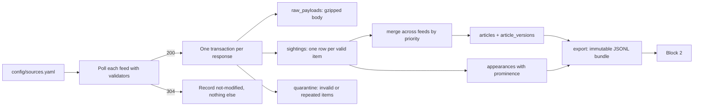

# Block 1: News ingestion architecture

Status: describes block 1 as built on 30 September 2026, written from the code in `ingest/`, at the level
needed to remember the design rather than to reimplement it. Operator detail is in
[`ingest/README.md`](../ingest/README.md) and [`ingest/docs/operations.md`](../ingest/docs/operations.md);
per-publisher findings are in [`ingest/docs/source-contracts.md`](../ingest/docs/source-contracts.md).
Companions: [Block 2: editorial architecture](editorial-architecture.md) and
[Block 3: publishing architecture](publisher-architecture.md). Pending work is in [the roadmap](roadmap.md).

## What block 1 is

Block 1 is `news-ingest`, a small Python 3.12 service and CLI in `ingest/`. It polls first-party RSS feeds
from seventeen configured sources (sixteen publishers plus the Via Ritzau press-release feed), 132 feeds
in all, every fifteen minutes under launchd. It stores every valid feed item it sees as a *sighting*,
maintains a rebuildable *article* projection from those sightings, records where each article was placed
in each feed, and publishes immutable JSONL export bundles that block 2 consumes. It never calls a model,
fetches an article page, ranks, summarises, or clusters: it is a deterministic witness to what the
configured feeds said and when.

## What it promises and what it refuses

"Coverage" means items observed in configured feeds while the collector was running, never every article
a publisher printed, because feeds are finite windows. Block 2 derives coverage from `health`, not from
the export.

The collector refuses, by rule rather than by omission, to select stories, score relevance, rewrite text,
cluster across publishers, crawl archives, fetch subscriber text, automate a browser or a login, or bypass
a paywall. The boundary is: no browser, no model, no credential, no Node. Four actions exist only as stubs
that report `disabled`: `enrich`, `snapshot-homepages`, `live-contracts`, and `replay-payloads`, and
configuration rejects NYT page fetching outright.

## The data model, and why it is shaped this way

**Sightings are facts; articles are a projection.** Every valid item in every polled feed becomes a
sighting row, including old items, unchanged items, and the same article seen in several feeds. The
`articles` table is derived from retained sightings by a pure merge and can be rebuilt at any time with
`rebuild-articles`, which uses the same merge and hashing code as live collection. A bug in normalisation
is therefore repairable without re-collecting, and the evidence trail block 2 relies on is never rewritten.

**The merge is per feed, then across feeds by priority.** Migration 004 keeps a small merge state per
article and feed (the winning snapshot and the winners of each nonempty field) and a merge head per article
holding a sighting-id watermark, so a poll reads only sightings above the watermark. Within a feed the
latest observation wins. Each feed state also records when each field's value last *changed within that
feed* (`revised_at`); a feed's first values only introduce the article. Across feeds a field is taken
from the newest revision; values no feed has revised are taken from the highest `description_priority`,
then the lowest configured order. Any revision outranks every unrevised value, whatever the feeds'
priorities. So DR section descriptions outrank DR latest descriptions whichever feed is polled first,
until one of them changes; an edit made while a feed carries the article wins until a newer one does;
and re-observing unchanged items never moves a field from one feed to another. The exception: an
already-edited value that first appears in a feed which never carried the old one is an introduction,
and loses to an older revision or a higher-ranked introduction. Canonical URLs are re-derived from raw
URLs with the current rules when merging, so a URL-rule fix reaches history without looking like an edit. `description_source` names the feed whose
description won; it is provenance, not content, and is excluded from `content_hash`.

**Raw payloads are kept, compressed, indefinitely.** Each distinct response body is stored once, gzipped,
keyed by its hash. `raw_payload_retention_days` is accepted by configuration and nothing prunes. After
`compact_after_days`, `compact-history` packs a feed's bodies from one UTC day into a single xz archive
with an index row per body. Successive bodies of one feed are nearly identical, so the archive is about
forty times smaller than the separate gzips; every body is verified against its hash before its gzip row
is removed, and remains readable byte for byte.

**Repeated observations are folded into runs after a week.** A poll records every item in its feed
whether or not anything changed, so most sightings and appearances repeat the previous poll exactly.
For history older than `compact_after_days`, an unbroken run of identical observations of one article
in consecutive successful polls of one feed keeps only its first and last rows; `run_polls` on the first
counts the polls the run covers. The merge needs only those ends (a revision starts a run, and the
latest observation ends one), so a rebuild reproduces the same projection. That holds because a
sighting folds only when its parse-time timestamps are later than every earlier sighting of that
article in that feed, the order the merge uses; after a clock correction the sightings are kept. An appearance's observation
time is its poll's end time, so exports restore the removed appearances from the poll log and are
byte-identical. A removed sighting's parse-time timestamps are not kept; its content, feed and poll are.

**Sighting content is deduplicated losslessly.** Migration 005 factors the three observation timestamps
out of each sighting's normalised JSON and stores the remaining content once in `sighting_contents`, keyed
by a storage digest scoped to the article identity; every original JSON string reconstructs byte for byte,
verified inside the migration's transaction. A populated database is migrated only by the explicit
`deduplicate-sightings --backup PATH` command, which holds the process lock and integrity-checks the
backup first. It was applied to the live database on 30 September 2026, backup at
`var/pre-dedup-2026-09-30.sqlite3`, then vacuumed.

**Identity is `(source, source_id)` and content has a hash.** Each publisher has one identity policy: the
RSS GUID, a UUID GUID, the GUID with URL fallback, or a regular expression over the URL. Identities are
never deduplicated across publishers. The content hash covers only article content; observation times,
feed positions, prominence, and raw metadata do not affect it. A changed hash appends a version snapshot
and advances `last_changed_at`; an unchanged one does not, and A to B to A yields three versions.

**Appearances record placement separately from content.** Each sighting produces an appearance naming the
feed, its surface kind (`homepage_rss`, `latest_rss`, or `section_rss`), the item's position, and any
publisher-supplied order (Politiken's `pol:order`). Prominence is the rank percentile within the snapshot
on a source-local 0 to 1 scale, capped by surface (1.0 homepage, 0.65 latest, 0.50 section), with a tier
and an evidence string. Each exported article summarises its strongest placement in `publisher_prominence`.

**Timestamps are UTC RFC 3339 text with six fractional digits.** Feed timestamps without an explicit
offset quarantine the item; RFC 2822 is accepted first and ISO 8601 second.

The schema is five forward-only, idempotent migrations: 001 the initial ten tables, 002 prominence
columns on appearances, 003 the sightings index on article identity, 004 merge state and merge heads, and
005 sighting content deduplication.

## Transactions and failure isolation

One successful `200` response is one transaction, which stores the payload, sightings, quarantines,
merge state, article projection and versions, appearances, poll outcome, and updated HTTP validators
together. If the feed is unusable, the whole transaction rolls back and only the failed poll is recorded
in a short separate transaction, which also increments `feed_state.consecutive_failures` and stores
`last_error_json`. A valid `304` records nothing but the poll and resets the failure count. Validators
advance only with committed data, so a crash cannot leave a feed believing it has seen content it did
not store.

Quarantine is per item, never per feed: an item that fails normalisation is recorded as `invalid_item`,
and a repeat of an article already placed in the same snapshot (BBC and WSJ do this) as
`duplicate_in_snapshot`, so the poll still succeeds.

One feed's error never stops the others, and the run reports `success`, `partial`, or `failed`. `health`
reports `degraded` with `feed_failures:<feed_id>` once a feed reaches three consecutive failures, and
`integrity_check_failed` if SQLite says so under `--deep`; without it `integrity` is `not_checked`,
because the full check reads every page and takes minutes on a multi-gigabyte database. A process lock (`flock` on `var/news-ingest.lock`) guards
every mutating command; a second writer gets a machine-readable `lock_busy` error instead of waiting.

## Configuration carries publisher behaviour

`config/sources.yaml` is the only place a publisher's feeds, surfaces, orders, description priorities,
identity policy, and language live. There is no module per publisher. The generic feed parser handles
every source; source-specific code is limited to URL cleanup rules (FT's `syn-*` parameters, Berlingske's
`referrer=RSS`), the identity regular expressions, and the Politiken order attribute. Adding a publisher
is a config change plus a live check recorded in `source-contracts.md`. The configuration is validated
before any network request: HTTPS only, unique feed ids, urls, and per-source orders, runtime paths inside
the repository, unknown fields rejected.

## Exports are the contract with block 2

`export` writes an immutable bundle: `articles.jsonl`, `appearances.jsonl` (when any), and a
`manifest.json` with the mode, the boundary, counts, and per-file hashes. A publication window selects
on `published_at`; `changed-since` selects on `last_changed_at` for corrections. Bundles are written to a
staging directory and published by one rename, never overwritten. The export holds the collector's
process lock while it reads and stamps `generated_at`, waiting up to ninety seconds for a poll in flight,
so that rows a poll stamps before its transaction commits can never fall behind an export's cursor.

The manifest's `coverage_gaps` and `warnings` arrays are always empty and it carries no feed inventory.
Block 2 does not rely on them: it calls `health`, derives each feed's outcome (`checked`, `failed`, or
`not_checked`) from `last_checked_at` and `consecutive_failures`, and states coverage as complete,
partial, or unknown from that.

## The CLI is an agent API

Every command runs through `gather_news.sh`, a self-locating wrapper that is safe to allowlist and needs
no `cd` or `uv`. Each call emits one JSON envelope on stdout with `ok`, `action`,
`result` or a typed `error` (`type`, `message`, `details`), and a `meta` block with the schema and CLI
versions. Usage errors exit 2, other failures exit 1, success exits 0. The actions are `list-actions`,
`validate-config`, `collect --once`, `health`, `export`, `backup`, `restore-check`, `rebuild-articles`,
`deduplicate-sightings`, `capture-fixture`, `benchmark-collect`, and `check` (lint, format, compile, the
offline tests), plus the four disabled stubs. Outputs are never overwritten; mutating actions take
`--dry-run`. Block 2 calls the wrapper the same way an operator does: `health` to decide whether a fresh
poll is needed, `collect --once` if it is, `export` with a publication window, and `health` for coverage.

## Decisions and the reasons behind them

- **First-party RSS only, no page fetching (7 September 2026).** NYT article pages return a DataDome
  challenge to any non-browser client, Politiken and DR pages have no JSON-LD, and DR hides its body in a
  Next.js data blob with hashed class names. Homepage HTML capture was assessed on 9 September and not
  built for the same reasons.
- **One generic feed adapter, behaviour in configuration.** The differences between feeds are data, not
  code: which feed is the homepage, which priority its descriptions carry, which pattern yields identity.
- **Sources widened (14 and 15 September 2026).** Five Danish and five international publishers joined,
  then Via Ritzau as a press-release feed, not a newsroom. Reuters, AP, Weekendavisen, and Zetland publish
  no first-party feed.
- **Merge state and content deduplication (29 and 30 September 2026).** A 31-minute poll against a
  2.2 GB database was traced to rereading every sighting on each observation and storing identical
  content once per observation; the watermark and migration 005 fixed both without losing an observation.

## Where block 1 stands

Built and running: seventeen sources, 132 feeds, all enabled, polled every 900 seconds by the launchd job
in `editorial/config/launchd/`. The one designed change waiting on block 1 is the late-discoveries item in
[the roadmap](roadmap.md), which depends on an observed-since export input that does not exist yet.
