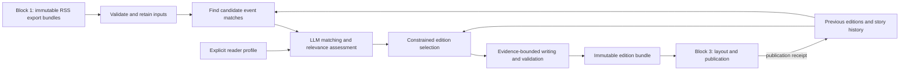

# Block 2: Personal newspaper editorial architecture

Status: architecture proposal, 7 September 2026. This document recommends boundaries and tradeoffs; it is not an implementation work breakdown. Its companion is [Block 3: Broadsheet publishing architecture](news-publishing-architecture-plan.md).

## Recommendation

Build a small, scheduled Python editorial application that consumes immutable `news-ingest` exports and produces an immutable, structured **edition**. Use LLMs for event matching, relevance assessment, and evidence-bounded writing. Use ordinary code for input validation, candidate retrieval, selection constraints, state, and publication decisions.

Keep `news-gatherer` unchanged as the acquisition system. Put blocks 2 and 3 in a separate downstream repository, provisionally `personal-newspaper`, with independently runnable editorial and publishing commands. They can run on one machine, on one schedule, without HTTP calls between them. Separate processes and file contracts provide the isolation needed here; microservices, a message broker, and an agent framework would add operating work without improving the newspaper.

The most consequential editorial choice is to make the unit of selection a **reported event or development**, while retaining every contributing publisher article. Cross-source deduplication means showing one treatment of an event with several source links. It never means deleting articles, collapsing publisher identities, or treating repeated reporting as proof.

## Start with the evidence the collector actually has

Release 1 supplies titles, RSS descriptions where available, publisher identities, URLs, timestamps, categories, and feed appearances. Nullable `public_lead` and `public_body` fields exist in the model; their existence does not mean that text has been acquired. The first newspaper should therefore contain concise digests of RSS evidence, with direct links to the original reporting. A fuller-looking newspaper must not be achieved by inventing fuller reporting.

The ingestion [implementation plan](news-ingestion-implementation-plan.md) remains authoritative for block 1. These downstream proposals do not enable its optional enrichment or homepage work. NYT article fetching remains prohibited. Any future text acquisition follows the existing source gates as a separately approved project; neither the LLM nor the publishing browser retrieves publisher pages.

The current code also matters at the handoff. Inspection of [`models.py`](../src/news_ingest/models.py), [`export.py`](../src/news_ingest/export.py), and [`db.py`](../src/news_ingest/db.py) establishes these integration constraints:

| Current behavior | Architectural consequence |
|---|---|
| Article identity is `(source, source_id)` and content has a `content_hash`. | Preserve that identity and reference the exact input bundle and content hash in editorial evidence. |
| Exports contain current article projections, rather than the complete article-version stream. | Retain consumed bundles. They allow reconstruction of what an edition used, but cannot recover every intervening publisher correction or an arbitrary historical as-of state. |
| Publication-window exports select by publication time; changed-since selects by content-change time. | Use both to handle current news, late discoveries, and corrections to older articles. A daily publication window alone is insufficient. |
| Placement-only changes do not advance article content-change time. | Refresh appearances for the active candidate window separately from content deltas. Do not use changed-since as a complete observation stream. |
| `publisher_prominence` summarizes the strongest retained placement; appearances carry observation timestamps. | Calculate recent prominence from relevant appearances. A historical high score must not make an old story permanently important. |
| The current manifest writes empty `coverage_gaps` and `warnings` and omits the full configured feed set required by the plan. | Treat coverage as unknown unless supported by actual collection/health evidence. Correct the upstream contract before relying on manifest completeness; do not read the ingestion database directly as a workaround. |

Validate bundle schemas, counts, and file hashes before importing, reject unsupported schema versions, and make repeated imports idempotent. Keep evidence references namespaced by publisher and input bundle; do not assume an ingestion database's local poll IDs are globally unique across rebuilds or different installations.

Before wiring production scheduling, reconcile the exporter with the plan's snapshot/cursor boundary rules. The current changed-since implementation does not explicitly enforce the documented upper bound. The consumer should use inclusive, overlapping checkpoints and advance them only after durable import; overlap is protection against boundaries, not a replacement for a correct producer contract. Capture a timestamped, secret-free collection/health sidecar while coverage reporting is being completed, clearly distinguishing its observation time from the export snapshot.

## Separate article, event, thread, and edition

Use four concepts with distinct lifetimes:

| Concept | Meaning |
|---|---|
| Article evidence | One publisher's observed text at a particular imported revision. Original identity, language, attribution, URL, and content hash remain attached. |
| Story/event | A specific occurrence or development that can receive one newspaper treatment: for example, a particular rate decision. Membership is a revisable editorial judgment. |
| Ongoing thread | Optional continuity between distinct developments, such as several decisions and reactions concerning the same central bank. This is useful memory, not one giant duplicate cluster. |
| Edition | A frozen selection and wording for one reader, cutoff, profile revision, and editorial run. Later corrections create a new revision or subsequent edition. |

Assign durable editorial story IDs when stories are first established. Do not derive a permanent ID solely from a membership list, which changes as reporting arrives. Record merges, splits, and supersession so a corrected match does not silently rewrite past editions. Keep the current clustering projection rebuildable from retained decisions and evidence.

## Deduplicate conservatively, with multilingual retrieval

Use a two-stage approach. First, inexpensive code proposes a limited set of plausible matches using publication/event timing, lexical overlap, named entities where available, and multilingual embeddings of the title plus description. Then an LLM decides whether the evidence describes the same development, a related development, a distinct story, or an uncertain match.

Multilingual retrieval belongs in the initial design because the configured publishers mix Danish and English. Title equality and English-only lexical matching will miss obvious cross-source matches. Start with vectors cached locally and a bounded in-memory similarity search over recent candidates. A separate vector database is unnecessary at this scale. Choose the embedding model and thresholds using actual Danish/English examples when implementation begins.

The LLM receives a small evidence packet and returns a validated decision with referenced article IDs and a short reason. Similarity only proposes candidates; it does not authorize a merge. Prefer a duplicate occasionally appearing twice over suppressing a genuinely different event.

Do not form final clusters by blindly taking connected components of pairwise matches. If A resembles B and B resembles C, A and C may still concern different events. Check proposed membership against the cluster's specific event description, dates, entities, and contradictory members. Split or leave separate when the evidence is insufficient.

Examples the design must handle include the same announcement in two languages, two different announcements by the same company, a news report and an opinion column about it, and a later correction or material development. Opinion can be linked as a perspective without being absorbed into the factual account. A changed headline alone is not automatically new news.

## Personalization should be explicit and inspectable

Use a small, versioned reader-profile file containing preferred topics and places, followed entities, exclusions, language, reading budget, and appetite for general-interest coverage. Store the profile privately. Do not infer a preference profile from unrelated Obsidian notes or from the fact that a device displayed something.

Have the LLM assess understandable dimensions: relevance to explicit interests, likely consequence, novelty relative to previous editions, and adequacy of available evidence. Let code combine those assessments with recency and recent publisher prominence under a visible policy. The assessments are editorial judgments, not calibrated probabilities of importance.

Selection happens across the edition, after clustering. Reserve some space for consequential general news and discovery outside explicit interests; cap repetitive topics; avoid letting the publisher with the most feed items dominate. Count distinct publishers rather than appearances when describing breadth of reporting, and do not present that count as independent corroboration. Publisher prominence is one bounded signal, not a cross-publisher universal ranking.

Prefer a simple weighted ordering followed by explicit diversity and space constraints to an opaque second LLM deciding the entire newspaper. Give every selected or rejected candidate a concise decision reason such as `already_covered`, `new_development`, `outside_budget`, or `insufficient_evidence`. Record the supporting dimensions so weights and exclusions can be adjusted without guessing what happened.

Feedback should initially be explicit: “more like this,” “less like this,” “already knew this,” or “wrong match.” Store feedback separately and propose profile changes for the reader to inspect. Passive viewing and source-link clicks are weak signals, especially on e-paper, and should not silently rewrite preferences.

## Writing must remain attached to source evidence

For selected stories, prepare a compact packet of attributed source text. Generate a headline, optional standfirst, and a small set of permitted copy lengths, such as brief, standard, and lead. These are maximum budgets, not word counts the model must fill. A title-only item can remain a headline with a source link; it need not become a paragraph.

Each factual sentence, including the headline, must map to the source passage or passages supporting it. Preserve who made a claim, uncertainty, numbers, dates, and disagreements. “Publisher A reports X; publisher B reports Y” is preferable to manufacturing agreement. Agreement between feeds still does not verify an event independently. Do not add background facts or causal explanations from model memory.

Translate into the chosen newspaper language while retaining original source text and language in the private evidence record. Do not turn a paraphrase into a quotation. Convert relative time expressions using the source and edition timestamps, or omit them when ambiguous. Label digests as based on RSS headlines/descriptions where that is the evidence available.

Validate output structure and reference integrity in code. Use an additional bounded LLM check for unsupported statements, changed attribution, and contradictions, with at most a small number of repairs. This check can catch mistakes; it is not proof of truth. If a story still fails, fall back to supported shorter copy or a source headline, or exclude it with an explicit reason. A missing paragraph is preferable to a confident invention.

Treat all source text as untrusted data. The editorial model has no browser, shell, publishing credentials, or acquisition tools. Feed text cannot alter the reader profile or authorize actions. URLs in final output come from validated input references, not strings invented by the model.

## The edition is the contract with block 3

Use versioned JSON with a published JSON Schema at this boundary. Markdown may be a useful preview, but should not be the primary machine interface. Block 2 owns meaning, selection priority, and permitted shortening; block 3 owns typography, coordinates, and actual pagination.

The conceptual edition contract should carry:

| Part | Required meaning |
|---|---|
| Identity and time | Edition ID and revision, cutoff, edition date, timezone, output language, schema version. Distinguish publication, observation, editorial generation, and eventual publication times. |
| Reproducibility | Input bundle references and digests; private references to profile, policy, prompts, models, and stored accepted responses. |
| Coverage | Configured source/feed inventory and known gaps, or explicit unknown status; no claim of complete publisher coverage. |
| Ordered stories | Story ID/revision, section, priority, intended role, required/optional status, permitted copy variants, source references, and evidence limitations. |
| Links and attribution | Primary reading link plus every contributing source, publisher, article ID, original title, timestamps, and supporting content hash. |
| Fit policy | Page budget/profile, allowed role or copy substitutions, ordered reserve stories, and what may be omitted if space is unavailable. |

Keep private audit material in a separate sidecar: evidence passages, cluster decisions, selection reasons, validation results, costs, and provenance. Export only the compact source attribution and limitations needed by the reader to block 3's public-facing content. Do not accidentally publish the reader profile or provider request logs with the newspaper.

The publisher returns a receipt identifying the actual stories, copy variants, and pages published. Update “included previously” memory from that receipt, rather than from drafts or failed runs. Record delivery attempts separately; published, served to a device, and read by a person are different facts. Block 3 cannot call an LLM to silently shorten or rewrite approved text.

## State, scheduling, and failure behavior

Use a separate SQLite database for imported article revisions, matching decisions, model-response caches, story history, edition status, and feedback. Store immutable input and output bundles on disk. Reuse the collector's operational principles: one writer, explicit ordering, short transactions, atomic directory publication, structured diagnostics, and backups. Never make a database transaction wait for a model call.

Use a scheduled batch, not continuous generation after each poll. A reasonable starting assumption is one morning edition in `Europe/Copenhagen`, with English copy as in the supplied visual reference, a one-page target, and up to two pages when justified. These are proposed defaults, not established user preferences. Exact delivery time, interests, and budget belong in the later configuration discussion.

At each run, freeze the imported input set and cutoff. Combine a rolling recent publication window with imported changes to older articles, compare against prior editions, and keep a longer bounded story memory for continuing events. For example, a 72-hour candidate window and several weeks of continuity can be evaluated during a pilot. Late arrivals can be eligible because they were newly observed; label their actual publication time. Material corrections can override normal repeat suppression.

Checkpoint import independently from successful newspaper publication: a model outage should not make ingestion progress disappear. Resume interrupted stages from retained inputs and responses. Cache keys include the exact relevant evidence and model/prompt revision; relevance additionally depends on profile, policy, cutoff, and prior-edition state. Placement-dependent decisions include appearance evidence even though article `content_hash` excludes it.

Do not promise deterministic LLM regeneration, even with low temperature. Reproducibility means retaining the accepted response and all of its inputs. Deterministic code can then reproduce the chosen edition from those stored results. A deliberate fresh model run creates a new run/revision.

Set per-run limits on candidates, calls, tokens, retries, and elapsed time. Start with one provider integration and one evaluated general-purpose model behind a small structured-call interface. Add cheaper models or selective escalation only after measurements show a benefit. Choose models using multilingual matching and attribution tests, rather than fixing a vendor or model name in this architecture plan.

If some sources fail, use valid evidence and display the resulting coverage limitation. If model processing fails, retain the last published edition with its original date; optionally issue a clearly labeled headlines-only fallback using deterministic policy. Do not disguise yesterday's newspaper as today's, or reuse an old summary against corrected source text.

## What would validate these decisions

Run a short pilot with manually judged examples from all five publishers. Evaluate matching precision and missed matches separately, including Danish/English pairs and distinct developments in the same thread. Inspect selected and rejected candidates, not just attractive finished pages. Track unsupported statements, missing attribution, excessive repetition, interesting omissions, reading time, per-edition cost, and deadline reliability.

The first useful milestone is one evidence-traceable edition, with visible reasons for its choices, successfully rendered by block 3. Next establish repeat suppression and correction handling across several mornings. Only then tune models, scoring, or add optional acquisition. No fine-tuning, autonomous researching agents, general knowledge graph, vector service, or collaborative editing system is required for that milestone.

The principal open product decisions are the reader's explicit interests, output language, preferred delivery time, page/reading budget, and tolerance for a headlines-only degraded edition. These do not prevent adopting the file boundary, conservative matching, evidence policy, and batch architecture now.
