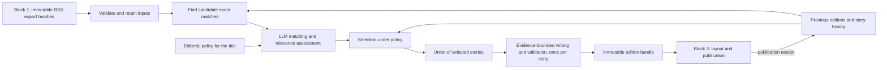

# Block 2: Newspaper editorial architecture

Status: architecture, 14 September 2026. This block is the editorial voice of a newspaper, and one edition is published to every reader. This document recommends boundaries and tradeoffs; it is not an implementation work breakdown. Its companion is [Block 3: Broadsheet publishing architecture](news-publishing-architecture-plan.md).

## Recommendation

Build a small, scheduled Python editorial application that consumes immutable `news-ingest` exports and produces an immutable, structured **edition**. Use LLMs for event matching, relevance assessment, and evidence-bounded writing. Use ordinary code for input validation, candidate retrieval, selection constraints, state, and publication decisions.

**This block is an editorial desk, not a recommender.** It produces one edition that every reader receives. There is no per-reader profile, no per-reader selection, no reading history, and no behavioral signal of any kind. What the paper covers is a standing editorial decision the owner makes and writes down, the same way a masthead decides its remit. That keeps the system free of personal data, keeps every reader looking at the same public page, and keeps the cost of an edition independent of how many people read it.

Keep the acquisition system unchanged as block 1. All three blocks live in one repository, `copenhagen-daily`, as sibling directories `ingest/`, `editorial/`, and `publisher/`, with independently runnable ingestion, editorial, and publishing commands. They can run on one machine, on one schedule, without HTTP calls between them. Separate processes and file contracts provide the isolation needed here; microservices, a message broker, and an agent framework would add operating work without improving the newspaper.

The most consequential editorial choice is to make the unit of selection a **reported event or development**, while retaining every contributing publisher article. Cross-source deduplication means showing one treatment of an event with several source links. It never means deleting articles, collapsing publisher identities, or treating repeated reporting as proof.



## Start with the evidence the collector actually has

Release 1 supplies titles, RSS descriptions where available, publisher identities, URLs, timestamps, categories, and feed appearances. Nullable `public_lead` and `public_body` fields exist in the model; their existence does not mean that text has been acquired. The first newspaper should therefore contain concise digests of RSS evidence, with direct links to the original reporting. A fuller-looking newspaper must not be achieved by inventing fuller reporting.

The ingestion [implementation plan](news-ingestion-implementation-plan.md) remains authoritative for block 1. These downstream proposals do not enable its optional enrichment or homepage work. NYT article fetching remains prohibited. Any future text acquisition follows the existing source gates as a separately approved project; neither the LLM nor the publishing browser retrieves publisher pages.

The current code also matters at the handoff. Inspection of [`models.py`](../ingest/src/news_ingest/models.py), [`export.py`](../ingest/src/news_ingest/export.py), and [`db.py`](../ingest/src/news_ingest/db.py) establishes these integration constraints:

| Current behavior | Architectural consequence |
|---|---|
| Article identity is `(source, source_id)` and content has a `content_hash`. | Preserve that identity and reference the exact input bundle and content hash in editorial evidence. |
| Exports contain current article projections, rather than the complete article-version stream. | Retain consumed bundles. They allow reconstruction of what an edition used, but cannot recover every intervening publisher correction or an arbitrary historical as-of state. |
| Publication-window exports select by publication time; changed-since selects by content-change time. | Use both to handle current news, late discoveries, and corrections to older articles. A daily publication window alone is insufficient. |
| Placement-only changes do not advance article content-change time. | Refresh appearances for the active candidate window separately from content deltas. Do not use changed-since as a complete observation stream. |
| `publisher_prominence` summarizes the strongest retained placement; appearances carry observation timestamps. | Calculate recent prominence from relevant appearances. A historical high score must not make an old story permanently important. |
| The current manifest writes empty `coverage_gaps` and `warnings` and omits the full configured feed set required by the plan. | Treat coverage as unknown unless supported by actual collection/health evidence. Correct the upstream contract before relying on manifest completeness; do not read the ingestion database directly as a workaround. |

Validate bundle schemas, counts, and file hashes before importing, reject unsupported schema versions, and make repeated imports idempotent. Keep evidence references namespaced by publisher and input bundle; do not assume an ingestion database's local poll IDs are globally unique across rebuilds or different installations.

Before wiring production scheduling, reconcile the exporter with the plan's snapshot/cursor boundary rules. The current changed-since implementation does not explicitly enforce the documented upper bound. The consumer should use inclusive, overlapping checkpoints and advance them only after durable import; overlap is protection against boundaries, not a replacement for a correct producer contract. Capture a timestamped, secret-free collection/health sidecar while coverage reporting is being completed, clearly distinguishing its observation time from the export snapshot.

## Separate article, event, thread, and edition

Use four concepts with distinct lifetimes:

| Concept | Meaning |
|---|---|
| Article evidence | One publisher's observed text at a particular imported revision. Original identity, language, attribution, URL, and content hash remain attached. |
| Story/event | A specific occurrence or development that can receive one newspaper treatment: for example, a particular rate decision. Membership is a revisable editorial judgment. |
| Ongoing thread | Optional continuity between distinct developments, such as several decisions and reactions concerning the same central bank. This is useful memory, not one giant duplicate cluster. |
| Title | The newspaper: a standing remit, masthead, schedule, and editorial policy. There is one. |
| Edition | One dated issue of one title: a frozen selection and wording for a cutoff, a policy revision, and an editorial run. A correction appears in a subsequent edition. |

Assign durable editorial story IDs when stories are first established. Do not derive a permanent ID solely from a membership list, which changes as reporting arrives. Record merges, splits, and supersession so a corrected match does not silently rewrite past editions. Keep the current clustering projection rebuildable from retained decisions and evidence.

## Cluster in one model call, then verify in code

Give the whole candidate window to one capable model in a single call per edition and let it group the articles. Do not build a retrieval stage, an embedding model, a vector cache, or similarity thresholds.

The arithmetic supports this. Measured on real collected articles, a title plus description averages about 51 tokens. A 72-hour candidate window across sixteen publishers is on the order of 1,200 articles (1,228 on 14 September 2026), so the whole set is roughly 60,000 input tokens. That is one modest call per edition, a handful of times a day, which is negligible against the cost of writing the stories.

The simplification is the stronger argument. Cross-lingual matching between Danish and English is exactly where embedding thresholds are most painful to tune and most fragile to maintain, and it is exactly what a capable general model does well without configuration. Removing the retrieval stage removes the most fragile components in this block: a model choice, a similarity threshold, a candidate-pair generator, and a cache to keep coherent with them.

Three design rules make the single call safe.

**Return groups, not assignments.** Ask for a list of clusters, each carrying a short event description, the member article IDs, and a confidence. Anything not mentioned is a singleton. Most articles are singletons, so the output stays short, and long enumerations are where a model drifts, duplicates, or silently drops an identifier. The event description is what makes a cluster checkable by a person afterwards.

**Move the cheap signal from before the model to after it.** The lexical and temporal checks that would have proposed candidates become a validator on the model's output instead. This is the same code in a better place: a pre-filter's misses are invisible and permanent, while a validator's flags are visible and cost nothing to review. Validate that every returned ID exists and appears at most once; that a cluster's members fall inside a plausible time span; that grouped articles share at least one rare term, named entity, or section; and that no cluster is implausibly large. A cluster that fails is split back into singletons and recorded, never silently accepted.

**Scrutinize cross-publisher clusters hardest**, because they are the ones that matter. Breadth drives the ranking formula below, so an over-merge does not merely duplicate a story, it promotes a story that was never that big. Cluster errors are amplified exactly where the stakes are highest, so a merge that raises a story's publisher count deserves the strictest check and, when uncertain, the split.

Instruct for conservatism and keep the standing preference: a duplicate occasionally appearing twice is better than suppressing a genuinely different event. Ask the model for coherent groups justified by a single event description rather than for pairwise matches, which is what keeps it from behaving like blind connected components. If A resembles B and B resembles C, A and C may still concern different events, and a group that cannot be described as one event is not a group.

If candidate volume ever outgrows a single call, shard by day or by section and cluster within shards before a smaller reconciliation pass. Do not reintroduce embeddings to solve a volume problem.

### Threads: the same call, a looser standard

A **thread** is a running narrative that several distinct events belong to over time. The September floods in Nepal are a thread; the flooding itself, Nepal accusing China of withholding weather data, and India calling China's response insufficient are three clusters inside it. Clusters answer "is this the same event"; threads answer "is this the same story".

Build them in the call already being made. Include in the prompt a compact list of active threads, each an identifier, a one-line description, and a last-seen date, and ask the model to attach every cluster it forms to an existing thread or open a new one. Active threads are a few dozen lines, so this adds almost nothing to a call that already carries the whole candidate window.

**Thread attachment is deliberately looser than cluster merging, and that is safe.** A bad merge changes what gets published, because two events become one story and one of them disappears. A bad thread attachment changes a ranking nudge and a "see also" link. The conservative bias belongs on clustering and must not be copied onto threading, which is what makes threading cheap to get right.

A thread goes dormant after a fortnight without a new story. Dormant threads leave the prompt to keep it small but are retained, so a revival reattaches rather than starting over.

Threads serve three purposes. They let repeat suppression distinguish "already covered" from "a new development in a story we ran", which is what allows day-three copy to refer to the floods without re-reporting them. They give the web edition a story history, which is something a website can offer that a printed paper cannot. And they contribute to ranking, as described below. The first two justify threads on their own.

Examples the design must handle include the same announcement in two languages, two different announcements by the same company, a news report and an opinion column about it, and a later correction or material development. Opinion can be linked as a perspective without being absorbed into the factual account. A changed headline alone is not automatically new news.

## The editorial policy is the newspaper's voice

The title has a small, versioned **editorial policy** file: its remit, meaning the subjects it covers and the subjects it deliberately leaves out; its standing interests and exclusions; the list of scoring publishers whose reporting decides what is news; output language; tone; reading budget and page target; and its appetite for general news outside the remit. This is the masthead's editorial line, written by hand by the owner and kept in version control, so every change to what the paper covers is a deliberate, reviewable commit.

It is not a user profile and carries no privacy weight. Nothing about it is inferred, learned, or derived from anyone's behavior. Publishing it as a "what this paper covers" page is a reasonable feature rather than a leak.

**Do not add reader tracking to inform it.** No click logging, no dwell time, no per-reader analytics, and no inference from the fact that a device displayed something. Those would recreate the personal data this design exists without, and they answer a question the paper is not asking. An editor decides what matters; readers are not consulted by instrumentation.

### Danish media decide what is news

**The paper is an overview of what Danish media are reporting. Settled 14 September 2026.** A story is
eligible for an edition only if at least one *scoring publisher* reports it. The scoring publishers are
every Danish outlet in the collector's configuration: DR, TV 2, Politiken, Berlingske, Jyllands-Posten,
Børsen, Information, Altinget, Kristeligt Dagblad, and Via Ritzau. The international outlets, the Financial Times, the New York Times, BBC News, The Economist, The
Guardian, The Washington Post, and The Wall Street Journal, are *linked publishers*: they
never make a story eligible and never contribute to its score, but when a scoring publisher reports a
story they also cover, their articles are attached to it as sources, so the reader gets the link and
the writer gets the evidence.

The distinction is a list in the editorial policy file, `scoring_publishers`, not a property of block 1's
configuration, because it is an editorial decision about what the paper is, not a fact about a feed. Any
publisher not on the list is a linked publisher. A Danish feed of primary material, such as Via Ritzau's
press releases, is listed separately as a *corroborating publisher*: it is evidence for a story other
outlets report, never a source of eligibility in itself, because a press release is a claim by an
interested party and not a news judgement. Settled 16 September 2026. Adding a new international feed changes nothing about
selection; adding a new Danish outlet to the list widens what counts as news.

Three consequences follow, and each is a rule:

- **Clustering still sees everything.** International articles enter the single clustering call, because
  matching them to Danish reporting is how they get attached. A cluster whose members are all linked
  publishers is dropped at selection with the decision reason `not_in_danish_media`, and the drop is
  recorded like any other rejection. It is never written, never scored, never counted.
- **Breadth and prominence count scoring publishers only.** `breadth` is the number of distinct scoring
  publishers on the story, and `peak_prominence` reads only their ranked surfaces. A story on DR,
  Berlingske, and the FT has breadth two, not three. The FT's front page placing it first is evidence
  for the writer, not a signal for the ranking.
- **Sources are complete.** The story's `sources[]` in the edition contract carries every contributing
  article, scoring and linked alike, with one primary. The primary is a scoring publisher's article.
  Block 3 renders and links them all; the web's dateline lists every publisher that contributed.

### Which articles a story carries, and which is primary

A story's sources are every article that supplied a fact, a quotation, or a judgement used in its copy,
from scoring and linked publishers alike. The rule is evidence, not volume: include at most one article
per publisher unless a second carries distinct evidence the copy actually uses, and prefer dated
articles to live blogs, rolling "latest" pages, and video reels, which are included only when they are
the sole coverage. The contract's cap of sixteen sources per story is kept: under this rule a story
that reaches it has drawn on every configured publisher, and a story that genuinely needs more is the
occasion to raise the cap with a new schema version, never to drop evidence silently.

The primary is the scoring publisher's article that supplied the most of the copy; on a tie, the one
with the fuller description, then the earlier one. The headline links to the primary, so it must be an
article a reader can open and recognise the story in.

The practical effect on prominence is that, of the ten scoring publishers, only Børsen and
Jyllands-Posten supply a ranked surface that counts (Børsen's homepage feed and Jyllands-Posten's
top-stories feed), since international homepage feeds do not score. Prominence is the weakest term, and
the weights below assume it.

### Sections come from the publisher, not from a model

Resolve a story's sections from feed provenance, never from an LLM's reading of the text. Every appearance record names the feed it was seen in and marks whether that feed is a section, homepage, or latest feed. Filtering to section feeds gives the publisher's own placement decision, which is a better authority on where an article belongs than any inference we could make.

A hand-written table maps each section feed to the title's own section vocabulary, so `dr.kultur`, `berlingske.kultur`, `ft.life_arts`, and `nytimes.arts` all resolve to culture. That table lives with the editorial policy, is inspectable, and needs no model. Coverage is 95 to 99 per cent once section feeds are configured for every source.

Three rules govern its use. Keep the resulting **set** of sections rather than collapsing to one label, because roughly an eighth of articles legitimately sit in more than one and that overlap is editorial signal. Resolve sections at edition time from all accumulated appearances, not once at first sight, because an article often reaches a section feed on a later poll than the latest feed that first surfaced it. And treat **opinion as a flag rather than a section**, since an opinion piece about culture is both; a comment column should compete for a culture slot carrying a marker, not occupy a separate section that displaces its subject.

Two feeds map to nothing on purpose. `borsen.breaking` and `borsen.longread` describe urgency and format rather than subject, and articles in them reliably appear in a subject feed as well.

### Weighting: the editor sets priorities, the day can overrule them

Rank candidate stories with a small, visible formula rather than a model call:

```
base  = 0.45 x breadth + 0.10 x peak_prominence + 0.30 x recency
      + 0.15 x thread_strength
score = base x section_weight
```

`breadth` is the count of distinct *scoring* publishers covering the story, normalized and deliberately non-linear, because the step from one publisher to two is the largest gain in evidence. Linked publishers do not count, however many of them carry the story. `section_weight` comes from the title's policy.

`peak_prominence` counts **only feeds whose order is editorial, and only on scoring publishers**. Feed ordering was tested on 8 September 2026. The three homepage feeds are ranked, as are `nytimes.world` and `borsen.finans`. Every `latest` feed and most section feeds, including `dr.indland`, `politiken.indland`, `ft.world`, and `berlingske.samfund`, are in strict reverse-publication order, so position in them carries no editorial signal whatsoever. Scoring those was counting recency a second time under another name. Score a chronological surface at zero and let recency do that job once.

Record prominence as **unknown rather than low** for a publisher with no ranked surface, and let the other terms carry the story. The distinction matters: a story missing from Børsen's homepage feed was genuinely not front-paged, which is real negative evidence, while a story missing from a DR ranked surface tells us nothing, because DR publishes none. Treating those as the same number would make prominence untrustworthy. Of the scoring publishers only Børsen and Jyllands-Posten supply it; the NYT, FT, BBC, and Guardian homepage feeds are ranked but belong to linked publishers and do not score. Extending prominence to the other Danish outlets requires homepage capture, which stays gated.

`recency` is measured in **editions, not hours**. A story published since the previous edition's cutoff scores 1.0, one edition older scores about 0.45, two editions older about 0.15. Anchoring to the cutoff rather than to a rolling clock is what makes a daily paper behave like one: a story filed just after yesterday's deadline is new to this edition even though it is more than a day old. A smooth linear decay barely discriminates between this morning and yesterday afternoon, which is the distinction that matters most.

Two clocks, deliberately. **Gate candidacy on observation time** so that a story the collector discovered late is still eligible, and **score recency on publication time** so that a genuinely old story is penalized for being old. A three-day-old article nobody noticed can earn a brief; it should not lead.

`thread_strength` is the peak breadth the thread ever reached, decayed by the number of editions since **this title last published from that thread**. It applies only when the paper actually ran a story from the thread, because the value being captured is continuity for a reader who read the earlier edition, not a generic boost for busy topics. A day-three follow-up to yesterday's lead scores meaningfully above an unrelated story with identical evidence; a fortnight later it scores below it. Setting this term to zero reproduces the behaviour of a paper with no memory, so it is a tunable rather than a commitment. The failure mode to watch in the editorial log is a long-running story that never dies and slowly crowds out fresh news.

Prominence takes only a tenth of the weight because it is measurably weak, as the next paragraph explains. Recency takes nearly a third because a daily brief should visibly prefer today. Note that repeat suppression, not the recency term, is what stops yesterday's lead from reappearing: a story already published does not return unless the thread produces a material development, which arrives as a new cluster with its own age.

Multiplying by the section weight rather than adding it gives the property that makes the numbers meaningful: **the ratio between two section weights is exactly the margin a story needs to overcome them.** With Denmark at 1.0 and technology at 0.5, a technology story must reach twice the base score of the best Danish story to lead the paper. An editor can reason about that directly and tune it without guessing.

Breadth carries half the weight for a measured reason. Section-feed prominence barely discriminates: across the corpus, position one in almost every section feed scores identically, because the score is a within-publisher feed position and section feeds are short. Only homepage feeds produce a strong prominence signal, and only a few publishers have one configured. Cross-publisher breadth is the signal that actually separates the day's big story from a well-placed minor one. Measured on real data, the largest story of the day appeared across five of the six publishers in the sample while a local item that outranked it on prominence alone appeared in one.

A caution confirmed by experiment. A naive clustering that merged any two articles sharing rare terms, closing transitively, produced clusters spanning business, Denmark, world, climate, and culture at once and inflated breadth for stories that were never the same event. That is the failure mode the cluster validator exists to catch. Breadth is only trustworthy on top of conservative matching, and because it multiplies the cost of an over-merge, the validator should be tested against Danish and English examples before these weights are tuned.

Have the LLM assess understandable dimensions: relevance to the title's remit, likely consequence, novelty relative to previous editions, and adequacy of available evidence. Let code combine those assessments with recency and recent publisher prominence under a visible policy. The assessments are editorial judgments, not calibrated probabilities of importance.

Selection happens across the edition, after clustering and before writing, so the desk never pays to write a story it will not run. Reserve some space for consequential general news and discovery outside the stated remit; cap repetitive topics; avoid letting the publisher with the most feed items dominate. Count distinct publishers rather than appearances when describing breadth of reporting, and do not present that count as independent corroboration. Publisher prominence is one bounded signal, not a cross-publisher universal ranking.

Prefer a simple weighted ordering followed by explicit diversity and space constraints to an opaque second LLM deciding the entire newspaper. Give every selected or rejected candidate a concise decision reason such as `already_covered`, `new_development`, `outside_budget`, `insufficient_evidence`, or `not_in_danish_media`. Record the supporting dimensions so weights and exclusions can be adjusted without guessing what happened.

Correction happens by editing the policy, not by learning. When an edition reads badly, the owner inspects the recorded decision reasons, changes the policy file, and commits. Keep a lightweight editorial log of judgments such as “wrong match,” “should not have led,” or “missed the obvious story,” tied to the edition and story IDs, so a policy change can be argued from examples rather than from memory. That log is an editor's notebook and an input to a human decision. It never adjusts weights on its own.

### Guidelines, not micromanagement

The editor is a model, and it is trusted as an editor. The paper runs a few model calls a day, so it can
afford a capable model, and a capable model given broad guidelines and a good example produces better
editions than one given a rulebook. The plans therefore codify three kinds of thing and deliberately
stop there: what the paper is (remit, scoring publishers, schedule, voice); the hard rules that protect
the reader and the evidence (eligibility, attribution, no invention, immutability, budgets as
ceilings); and the working method (the run, the budget, the repair order). Everything else, which
story leads on a day with two contenders, whether a figure beats a quote, whether a timeline earns its
space, how a Danish institution is named in English, is guidance with a reason attached, and the
editor may depart from it when the day demands and say so in the editorial log. Do not turn guidance
into validators. A rule that the model must follow algorithmically belongs in code; a judgement that a
good editor would make belongs in the prompt as advice.

The working material for the editor lives in `editorial/`: the policy file `policy.yaml` with the
scoring publishers, section table, section weights, kicker vocabulary, budgets, and schedule; the desk
handbook `HANDBOOK.md` with the run, the budget, the repair order, and the callout guidance; and the
golden example under `examples/`, the edition of 15 September 2026 with the reasoning behind each
choice, which is both the quality bar and block 2's first test fixture. A style guide, `STYLE.md`, is
still to be written: spelling, numbers and currency, English names for Danish institutions, how Danish
titles and quotations are rendered. Until it exists the golden example is the style reference.

## Writing must remain attached to source evidence

For selected stories, prepare a compact packet of attributed source text. Generate a headline, optional standfirst, and a small set of permitted copy lengths named `short`, `standard`, and `extended`. These names are deliberately distinct from the story roles `lead`, `secondary`, and `brief`, which describe prominence rather than length. These are maximum budgets, not word counts the model must fill. A title-only item can remain a headline with a source link; it need not become a paragraph.

Each factual sentence, including the headline, must map to the source passage or passages supporting it. Preserve who made a claim, uncertainty, numbers, dates, and disagreements. Agreement between feeds still does not verify an event independently. Do not add background facts or causal explanations from model memory.

**Attribute by citation, not by prefix. Settled 11 September 2026.** Every paragraph and every brief lede is `{text, sources[]}`: the prose states what happened, and the publisher ids in `sources[]` say who reported it. Block 3 renders them as a trailing marker linking to the article. Copy must not open with "X reports that" or rotate through synonyms for it; in a paper where every sentence is a digest, the prefix repeats on every paragraph and carries nothing the marker does not. Name a publisher inside the sentence only when the point is that publishers differ: "Politiken puts the vote at 29 to 26; DR reports 28 to 27" is prose because the disagreement is the news. A quote's reporting publisher is likewise a publisher id.

### Writing guidelines: facts first, colour only with a name on it

**Settled 14 September 2026.** The evidence block 2 writes from
is RSS descriptions, and Danish outlets write those as teasers: "Valggyser kan trække i langdrag",
"vidste ikke hvilket ben de skulle stå på". A faithful paraphrase carries the teaser's voice into the
paper, where it reads as the paper's own opinion, because the citation sits on the paragraph and is
invisible in the prose. Unchecked, the result is copy that is at once padded, editorialised, and
structurally serialised by outlet. These guidelines prevent that. They are guidelines, not validators: the writer
weighs them, and the review step flags departures rather than rejecting them.

1. **Every sentence should carry a new fact**: an actor, a number, a time, a place, or a decision. A
   sentence that only characterises ("it is a thriller that may drag on") is cut, not rewritten.
2. **Colour is attributed or cut.** The paper's own voice is plain. Idiom, metaphor, and mood from a
   source are either translated to their plain meaning or kept as that source's characterisation with
   the outlet or speaker named in the sentence: "Altinget called the night a thriller", never "it was a
   thriller". A direct quotation with a named speaker is always allowed. On a slow news day a story may
   carry attributed colour as padding; unattributed colour is never padding.
3. **Synthesise, do not serialise.** One story is one account. Sources are citations on sentences, not
   units of structure; a paragraph per outlet restating the same fact is the tell of summarisation. An
   outlet is named in prose only when outlets disagree or when guideline 2 requires it.
4. **Answer first.** The result and what happens next, then how it unfolded, then reactions and analysis.
   The teaser's suspense structure is inverted.
5. **Analysis has a name.** Judgements are attributed to a person or a title, never floated as the
   paper's view.
   The test for whether a source is named in the sentence or only cited in the marker is *whose
   authority the sentence rests on*. A fact of record, something that happened, a number, a date, a
   decision, rests on the event itself: "The overnight count left two seats between the blocs" is
   cited by the marker and names nobody, however many outlets reported it. A sentence that rests on
   the source's own judgement, observation, or access names the source in prose: "Kristeligt Dagblad
   describes empty dance floors", "an analyst quoted by Børsen hopes it does not distract", "Elisabet
   Svane attributes the fall to the green change of course". Naming in prose is therefore a signal to
   the reader that this is one outlet's view or eyewitness account rather than the settled record, and
   it is never used for facts, because that would suggest the fact is contested when it is not. Where
   the speaker is unnamed, the chain of attribution is kept: "an analyst quoted by Børsen", not "an
   analyst". A direct quotation names its speaker and, if the speaker is not obvious, the outlet that
   obtained it.
6. **The headline and deck carry the drama; the body may be plain.**
7. **A word budget per role** keeps density a constraint rather than a hope: lead 120 to 180 words,
   secondary 60 to 110, brief one sentence under 35. Thin evidence produces a short story, not a padded
   one; guideline 1 wins over filling the slot.
8. **Respect the reader's time.** The paper never pads for its own sake. A slow news day makes a shorter
   newspaper, not a thinner one: fewer stories, shorter stories, empty slots left empty. The reader stays
   engaged because every sentence carries something relevant to them, and when the sentences stop the
   reader is done and can get on with their day. The budgets in guideline 7 are ceilings, never targets,
   and the attributed colour guideline 2 allows on a slow day is a courtesy to the source's voice, not a
   way to fill space.

Translate into the chosen newspaper language while retaining original source text and language in the private evidence record. Do not turn a paraphrase into a quotation. Convert relative time expressions using the source and edition timestamps, or omit them when ambiguous. Label digests as based on RSS headlines/descriptions where that is the evidence available.

Validate output structure and reference integrity in code. Use an additional bounded LLM check for unsupported statements, changed attribution, and contradictions, with at most a small number of repairs. This check can catch mistakes; it is not proof of truth. If a story still fails, fall back to supported shorter copy or a source headline, or exclude it with an explicit reason. A missing paragraph is preferable to a confident invention.

Callout text is approved copy written here, at generation time, with the same evidence discipline as the body. Block 3 chooses only which callouts fit; it never composes or edits their wording.

Treat all source text as untrusted data. The editorial model has no browser, shell, publishing credentials, or acquisition tools. Feed text cannot alter the editorial policy or authorize actions. URLs in final output come from validated input references, not strings invented by the model.

## The edition is the contract with block 3

Use versioned JSON with a published JSON Schema at this boundary. Markdown may be a useful preview, but should not be the primary machine interface. Block 2 owns meaning, selection priority, and permitted shortening; block 3 owns typography, coordinates, and actual pagination.

**Block 3 owns the schema itself**, published as hand-written JSON Schema Draft 2020-12 with golden acceptance and rejection documents. Every published schema is an immutable numbered artifact, and every accepted-shape change, including an optional field or new callout kind, creates a new integer version. Unknown fields are rejected, so older renderers cannot be assumed to accept newer output. Block 2 selects a supported version/digest, validates with the identical schema and equivalent format assertions, runs the shared semantic rejection corpus, and calls block 3's `validate` as final preflight. The detailed contract is Section 5 of the [publishing implementation plan](news-publishing-implementation-plan.md).

The conceptual edition contract should carry:

| Part | Required meaning |
|---|---|
| Identity and time | Title ID, edition ID, cutoff, edition date, timezone, output language, schema version. The title ID selects the masthead and device profile block 3 holds for it. Distinguish publication, observation, editorial generation, and eventual publication times. |
| Reproducibility | Input bundle references and digests; private references to profile, policy, prompts, models, and stored accepted responses. |
| Coverage | Configured source/feed inventory and known gaps, or explicit unknown status; no claim of complete publisher coverage. |
| Ordered stories | Unique story IDs in authoritative array order, with no redundant `order` field. `device_participation` is `required`, `optional`, or `reserve`; all are accepted web stories. Exactly one lead is first and required. Other roles are secondary and brief, with only secondary-to-brief fallback. Approved bodies are `short`, `standard`, and `extended`, with optional `headline_short` and a publisher-prefixed lede for any brief-capable story. Attributed callouts use the five declared kinds. Reader-facing kickers carry section presentation; internal ranking dimensions stay in private editorial records. |
| Presentation intent | A preferred device composition, an edition emphasis such as `one_big_story` or `quiet_day`, masthead ear text, and the edition name and number. These are hints. Block 3 substitutes a different composition when the preferred one cannot hold the requested story counts, and reports what it chose. |
| Links and attribution | Primary reading link and every contributor, preserving block 1's `(source, source_id)`, an opaque input-bundle reference, original title, timestamps, and supporting content hash. Publisher display names come from block 3 config. No local paths enter public provenance. Evidence limitations must be visible to readers. |
| Fit policy | **Device only.** Role/composition permissions, a duplicate-free omission list containing every optional ID, and a duplicate-free attempt list containing every reserve ID. Required stories occur in neither list. Reserves are inserted in their contract-order position after a base fit; all reserves still appear on the web and enter publication memory. Device output remains one page. |

Keep private audit material in a separate sidecar: evidence passages, cluster decisions, selection reasons, validation results, costs, and provenance. Export only the compact source attribution and limitations needed by the reader to block 3's public-facing content. The editorial policy is not secret and may be published deliberately, but prompts, provider request logs, model responses, and cost records must never reach the newspaper.

The publisher returns separate web and device sets, chosen composition, roles, headline/body variants, slots, callout indices, omissions, and structural elements. Update “included previously” memory from the **web set** only after an activated receipt is acknowledged, idempotently by edition ID and manifest digest. A stored bundle or fitting report is not activation evidence. If stdout is lost, use `receipt --edition <id>`; if activation is pending, run `recover` and look up the receipt again, rather than generating a different edition to escape the conflict. Block 3 retains activation evidence beyond release cleanup. Stored receipts omit their enclosing manifest digest; the outer lookup/command result supplies it. Local activation, external hosting, device delivery, and reading are separate facts.

### Story budget and device capacity

The web edition carries every accepted story; the device page carries what fits, and whether it fits is
decided before publication, not after. Block 3's built composition holds one lead, up to three
secondaries, and up to four briefs. The required set must fit that capacity, so block 2 marks stories
beyond it `optional`, gives a secondary that can live as a brief a `fallback_role`, and treats the web
as the place where the rest of the day's news lives. Typical editions carry three to five secondaries
and eight to sixteen briefs on the web; a quiet day carries fewer, and that is a complete edition rather
than a thin one.

### Repairing a fit failure

Block 3's fit report names the slot and the shortfall. Block 2 repairs in a fixed order and stops as
soon as `fit` passes: first participation (the weakest required secondary becomes optional with a brief
fallback, briefs beyond four become optional); then the lead's own variants (a shorter deck, the short
headline); then the supporting stories' copy (the required briefs' ledes shortened by a line, then the
secondaries' `short` variants); only then which stories are required. A fit is never repaired by cutting
a source, a qualifier, or an attribution, and the edition id does not change between attempts.

Fit reports name failed fields and actual clipping, with advisory nullable line/character estimates. Capacity failures, layout failures, exhausted search, and unavailable rendering tools are distinct causes; retry copy only when the cause calls for editorial repair. The web can publish with failed/skipped device output under the publisher's failure table, so check the activated result before any rewrite retry. A published edition cannot subsequently gain a repaired device image in release 1; improved copy belongs to a new edition. Block 3 never calls an LLM to repair text.

## State, scheduling, and failure behavior

Use a separate SQLite database for imported article revisions, matching decisions, model-response caches, the written story pool, story history, edition status, and the editorial log. Store immutable input and output bundles on disk. Reuse the collector's operational principles: one writer, explicit ordering, short transactions, atomic directory publication, structured diagnostics, and backups. Never make a database transaction wait for a model call.

Use a scheduled batch, not continuous generation after each poll. The title publishes one morning edition in `Europe/Copenhagen`, with English copy as in the supplied visual reference, and a one-page device edition. Multiple titles are designed in the [roadmap](roadmap.md).

At each run, freeze the imported input set and cutoff. **Default the candidate window to 72 hours of publication time**, and hold continuity for several weeks. The window is a backstop rather than the main mechanism: with recency anchored to edition cutoffs, anything past two editions already scores 0.15 and is effectively buried, so the gate exists to stop genuinely stale material appearing at all rather than to rank.

### Reading past editions

Every run begins by reading the paper it has already published. Block 2 loads the published contracts
of the last fortnight from block 3's store, newest first, and from them builds three things: the set of
story ids and the articles each carried, which is the "already covered" memory; each story's thread,
which is what lets day-three copy refer to a story without re-reporting it; and the day each ran, which
is what the recency and thread terms are measured against. A candidate cluster that overlaps a
published story's articles is covered unless it brings a material development, a new decision, number,
actor, or consequence; further analysis of the same event is not a development. Memory advances only
from an activated publication receipt, so an edition that failed to publish leaves no trace in it.

Gate and score on different clocks, as the weighting section describes. Candidacy also admits anything newly observed since the previous edition, so a late discovery stays eligible even when the article is older; recency then scores it on publication time, so it can earn a brief without leading. One exemption to the window: a material correction to an older article is new information and is admitted regardless of the original's age. Block 1's changed-since export exists to surface exactly those. Late arrivals can be eligible because they were newly observed; label their actual publication time. Material corrections can override normal repeat suppression.

Checkpoint import independently from successful newspaper publication: a model outage should not make ingestion progress disappear. Resume interrupted stages from retained inputs and responses. Cache keys include the exact relevant evidence and model/prompt revision. Matching and writing depend only on evidence; relevance assessment additionally depends on the policy revision, cutoff, and prior-edition state. Placement-dependent decisions include appearance evidence even though article `content_hash` excludes it.

Do not promise deterministic LLM regeneration, even with low temperature. Reproducibility means retaining the accepted response and all of its inputs. Deterministic code can then reproduce the chosen edition from those stored results. A deliberate fresh model run creates a new run.

Set per-run limits on stories written, repair rounds, and elapsed time, and record them in the policy file. Start with one capable general-purpose model for the editor; the checker may run on a different one, since a different model has different blind spots. Choose models using multilingual matching and attribution tests, rather than fixing a vendor or model name in this architecture plan.

If some sources fail, use valid evidence and display the resulting coverage limitation. If model processing fails, retain the last published edition with its original date; optionally issue a clearly labeled headlines-only fallback using deterministic policy. Do not disguise yesterday's newspaper as today's, or reuse an old summary against corrected source text.

## What would validate these decisions

Run a short pilot with manually judged examples from every publisher. Evaluate matching precision and missed matches separately, including Danish/English pairs and distinct developments in the same thread. Inspect selected and rejected candidates, not just attractive finished pages. Track unsupported statements, missing attribution, excessive repetition, interesting omissions, reading time, per-edition cost, and deadline reliability.

The first useful milestone is one evidence-traceable edition, with visible reasons for its choices, successfully rendered by block 3. Next establish repeat suppression and correction handling across several mornings. Only then tune models, scoring, or add optional acquisition. No fine-tuning, autonomous researching agents, general knowledge graph, vector service, or collaborative editing system is required for that milestone.

The principal open product decisions are the title's remit, output language, publication times, page and reading budget, and tolerance for a headlines-only degraded edition. These do not prevent adopting the file boundary, conservative matching, evidence policy, and batch architecture now.
