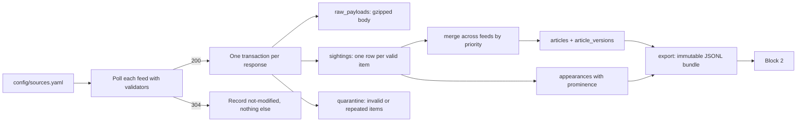

# Block 1: News ingestion architecture

Status: architecture, 14 September 2026, written from the code as it runs. It describes what block 1 is, how it is built, and the decisions that shaped it,
at the level of detail needed to remember the design rather than to implement it. The
[implementation plan](news-ingestion-implementation-plan.md) remains the exhaustive specification
and is authoritative where this document is silent. Companions:
[Block 2: editorial architecture](news-editorial-architecture-plan.md) and
[Block 3: publishing architecture](news-publishing-architecture-plan.md).

## Recommendation, as built

Block 1 is `news-ingest`, a small Python 3.12 service and CLI in `ingest/`. It polls first-party RSS
feeds from sixteen publishers every five minutes, stores every valid feed item it sees as a
*sighting*, maintains a rebuildable *article* projection from those sightings, records where each
article was placed in each feed, and publishes immutable JSONL export bundles for block 2. It never
calls a model, never fetches an article page, never ranks, summarises, or clusters. Its job is to be a
faithful, deterministic witness to what the configured feeds said and when.

## What it promises and what it refuses

"Coverage" means items observed in configured feeds while the collector was running. It never means
every article a publisher printed, because feeds are finite windows; the README, the health output,
and every export manifest say so.

The collector refuses, by rule rather than by omission, to select stories, score relevance, rewrite
text, cluster across publishers, crawl archives, fetch subscriber text, automate a browser or a
login, or bypass a paywall. Two capabilities exist in the code but are gated off: article-page
enrichment for public text, and HTML homepage capture for placement. Both stay disabled until the
gates in the implementation plan are met and the owner approves them, and NYT article fetching is
disabled permanently because NYT serves a bot challenge to any non-browser client.

## The data model, and why it is shaped this way

**Sightings are facts; articles are a projection.** Every valid item in every polled feed becomes a
sighting row, including old items, unchanged items, and the same article seen in several feeds. The
`articles` table is derived from sightings by a pure merge and can be rebuilt at any time with
`rebuild-articles`, which uses the same merge and hashing code as live collection. This is the single
most important decision in the block: it means a bug in normalisation is repairable without
re-collecting, and it means the evidence trail block 2 relies on is never rewritten.

**Raw payloads are kept, compressed, indefinitely by default.** Each distinct response body is stored
once, gzipped, keyed by its hash. Retention is configurable and defaults to forever, because the
payloads are small, the disk is cheap, and `replay-payloads` can re-derive everything above them.

**Identity is `(source, source_id)` and content has a hash.** Publishers get a stable identity policy
from a short list: the RSS GUID, a UUID GUID, the GUID with URL fallback, or a regular expression over
the URL. Identities are never deduplicated across publishers. A canonical content hash covers only the
fields that are article content; observation times, feed positions, and raw metadata do not affect it.
A changed hash appends a full version snapshot, an unchanged one does not, and A → B → A yields three
versions.

**Appearances record placement separately from content.** Each sighting produces an appearance
naming the feed, its surface kind (homepage, latest, or section), the item's position, and any
publisher-supplied order. Prominence is derived from that on a 0 to 1 scale with ceilings by surface,
normalised by the snapshot's item count, and exported with its evidence so a consumer can audit it.
Placement is observation metadata: it never touches the content hash.

**Timestamps are UTC RFC 3339 text with six fractional digits.** Feed timestamps without an explicit
offset are invalid and quarantine the item; RFC 2822 is accepted first and ISO 8601 second.

The schema is eleven tables in two forward-only, idempotent migrations: runs, polls, feed state,
raw payloads, sightings, articles, article versions, appearances, quarantine, and enrichment jobs.

## Transactions and failure isolation

One successful `200` response is one transaction, which stores the payload, the sightings, the
quarantines, the article projection and versions, the appearances, the poll outcome, and the updated
HTTP validators together. If the feed is unusable, the whole transaction rolls back and only the
failed poll is recorded in a short separate transaction. A valid `304` records nothing but the poll.
Validators advance only with committed data, so a crash cannot leave a feed believing it has seen
content it did not store.

Publisher failures are isolated: one feed's error never stops the others, and the run reports
`success`, `partial`, or `failed` with per-feed detail. A process lock guards every mutating command,
and a second writer gets a machine-readable `lock_busy` error instead of waiting.

## Configuration carries publisher behaviour

`config/sources.yaml` is the only place a publisher's feeds, surfaces, orders, description priorities,
identity policy, and language live. There is no module per publisher and no adapter hierarchy. The
generic feed parser handles every source; source-specific code is limited to URL cleanup rules (FT's
`syn-*` tracking parameters, Berlingske's `referrer=RSS`), the identity regular expressions, and the
Politiken order attribute. Adding a publisher is a config change plus a documented live check.

The configuration is validated before any network request: HTTPS only, unique feed ids, urls, and
per-source orders, runtime paths inside the repository, and environment interpolation only for fields
ending in `_env` so no secret is ever serialised.

## Exports are the contract with block 2

`export` writes an immutable bundle: `articles.jsonl`, `appearances.jsonl`, and a `manifest.json`
carrying the window, counts, per-file hashes, and warnings. Two selection modes exist because block 2
needs both: a publication window for the day's news, and `changed-since` for late discoveries and
corrections to older articles. Bundles are written to a staging directory and published by one rename,
never overwritten, and are schema-validated before publication.

The manifest still writes empty coverage gaps and omits the configured feed inventory the plan
requires. Block 2 must therefore treat coverage as unknown rather than complete until that is fixed.

## The CLI is an agent API

Every command runs through `gather_news.sh`, a self-locating wrapper that is safe to allowlist and
needs no `cd`, activated environment, or `uv`. Each call emits one JSON envelope on stdout with `ok`,
`result` or a typed `error`, and diagnostics on stderr. Exit codes distinguish usage errors from
failures. `list-actions` describes every action and parameter, `validate-config` checks configuration
offline, `collect --once` polls, `export` and `backup` refuse to overwrite, `restore-check` verifies a
backup, `health` reports feed state against the failure threshold, and `check` runs the offline
verification suite. Block 2 will invoke this the same way an operator does.

## Decisions and the reasons behind them

- **First-party RSS only, no page fetching (7 September 2026).** Live probing showed NYT article pages
  return a DataDome challenge to any non-browser client, Politiken and DR pages have no JSON-LD, and DR
  hides its body in a Next.js data blob with hashed class names. Plain-HTTP enrichment was possible
  for at most some publishers and fragile for all; RSS was available for every one.
- **One generic feed adapter, behaviour in configuration.** A module per publisher was rejected
  because the differences between feeds are data, not code: which feed is the homepage, which
  priority its descriptions carry, which regular expression yields identity.
- **Sightings-derived articles, indefinite raw retention, replay.** Chosen together so that every
  layer above the raw payload is reproducible and no correction to normalisation requires
  re-collection.
- **Exports select by content-change time, not by a version cursor.** A content-change timestamp is
  simpler for the consumer than a cursor over article versions and answers the actual question, which
  is "what did I not see last time".
- **Homepage capture assessed and gated (9 September 2026).** Politiken exposes usable attributes,
  Berlingske hides content in an opaque blob, DR's class names would break on every redeploy. Not
  worth a subsystem; the four attributes Politiken offers are captured behind a gate.
- **Prominence is bounded and surface-aware (8 September 2026).** Only feeds with editorial order carry
  a placement signal; latest and most section feeds are strictly reverse-chronological. Ceilings by
  surface and an audit trail per appearance keep the number honest.
- **Danish sources widened, international linked (14 September 2026).** TV 2, Jyllands-Posten,
  Information, Altinget, and Kristeligt Dagblad joined as Danish sources, and BBC News, The Economist,
  The Guardian, The Washington Post, and The Wall Street Journal as international ones. Reuters and AP
  publish no first-party feed; Weekendavisen and Zetland have none either. Two facts from that day
  shaped the code: BBC GUIDs carry a per-feed fragment, so BBC identity is the URL article id, and BBC
  and WSJ list some items twice in one snapshot, so a repeat is quarantined as `duplicate_in_snapshot`
  rather than failing the poll.
## Where block 1 stands

Built and running. Sixteen publishers and 131 feeds, all succeeding on the poll of 14 September 2026.
Twenty-eight offline tests cover normalisation, identity, timestamps, prominence, the database, and
the CLI; `./gather_news.sh check` runs lint, format, and tests. Live contract checks exist as an
action but are release-gated. Scheduling is documented for cron, systemd, and launchd and is not
installed automatically. The open items are the manifest's coverage inventory, and the two gated
capabilities, enrichment and homepage capture, which wait on their gates and the owner's approval.
