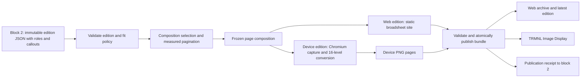

# Block 3: Broadsheet publishing architecture

Status: architecture proposal, 7 September 2026, revised 8 September 2026 for per-edition layout variation, callouts, and the two-output requirement. This document recommends the publishing approach and decision boundaries; it is not a detailed implementation plan. Its companion is [Block 2: Personal newspaper editorial architecture](news-editorial-architecture-plan.md).

## Recommendation

Build a **static edition publisher** using Astro, reusable HTML/CSS newspaper templates, and a pinned Playwright/Chromium renderer. It produces two outputs from one frozen edition: a **device edition**, one or more 1872 × 1404 16-level grayscale PNG pages for the TRMNL X, and a **web edition**, a static broadsheet-styled site that carries the same stories with more detail. Deliver the PNG through TRMNL's existing Image Display plugin first.

Editions must not look identical from day to day. Each edition has exactly one lead story, but the number of secondary and brief stories, the composition they sit in, and the callouts attached to them vary with the editorial contract from block 2. The variation is driven by editorial signals, never by randomness, so that a reader sees the emphasis an editor chose. The design direction is worked out in `plans/design/` and summarized below.

A conventional CMS is not the primary missing component. Block 2 already supplies structured, edited content; the difficult remaining work is fitting that content into readable pages consistently. Start with file-based editions and a standard static site generator. Add Keystatic as an editing interface only if manually correcting headlines, pinning stories, or adjusting sections becomes a regular task. Do not build a custom administration application.

Keep this publisher in the proposed downstream `personal-newspaper` repository, alongside but independently runnable from the Python editorial application. The TypeScript/Node toolchain is confined to publishing. Its browser renders only our generated pages and local assets. No browser dependency or publisher browsing is introduced into `news-ingest`; its existing restrictions remain in force.

## What to take from the visual reference

The [supplied newspaper image](https://youyesyou.me/todays_news.png), inspected on 7 September 2026, uses a large serif masthead, horizontal rules, a wide lead story, three secondary columns, a bottom strip of short briefs, compact source labels, and restrained grayscale. Its newspaper character comes mainly from hierarchy, typography, and spacing; photographs are not necessary.

Use that visual grammar as the starting point, then extend it. The reference's grey callout box in the Arctic column is the pattern to generalize: a lifted phrase, number, quote, or fact list that belongs to a story and pulls the eye to it. Do not carry its example news, date, masthead, or publisher list into generated editions as defaults. In particular, Weekendavisen appears in the reference but is not in the collector's configured five-publisher scope. Display only actual contributing publishers, with collection limitations separately available.

The TRMNL X specification is a 10.3-inch display with **1872 × 1404 pixels and 16 grayscale levels**. Start with a landscape 4:3 device profile matching the reference. Portrait can be another composition later, rather than a rotated landscape newspaper. [TRMNL X specifications](https://enterprise.trmnl.app/products/x/spec-sheet).

Design for reading at the actual physical display size. Pixel count alone does not establish legibility. Begin with large enough body copy and fewer stories, then tune on the device. A broadsheet aesthetic does not require reproducing the density of a physical broadsheet on a 10.3-inch panel.

## Design direction

The mockups in `plans/design/` (`device.html` with three compositions, `web.html`, and `README.md` with the token and element catalogue) set the direction. The essentials:

- **Type.** Playfair Display for the masthead, lead headline, pull quotes, and big figures; Source Serif 4 for everything else, including secondary headlines in bold. Small caps, not tracked capitals, for kickers, datelines, and source rows. Body copy on the device starts at 30 px with 26 px as the floor for briefs.
- **Colour.** The device edition is pure black text on pure white, with two fill greys and one hairline grey chosen to land exactly on levels of the 16-step palette. The web edition adds a warm paper tone and a single dark-red accent for links and the pull-quote bar. Nothing else is coloured.
- **Story roles.** Exactly one lead (H1) per edition, always on page 1: kicker, display headline, italic deck, optional callout, optional one- or two-column body with a drop cap, source row. Zero to four secondary stories (H2) per page with a headline in the text face, short body, optional callout. Zero to eight briefs (H3) per page: headline plus a one-line lede opening with the publisher's name.
- **Callouts.** Five kinds, each attached to a story and attributed in that story's source row: `quote` (rule at the left, display italic, speaker and reporting publisher), `figure` (one large numeral with an italic label), `facts` (two to four dashed bullets on a grey fill), `box` (a small-caps label over a bold phrase on a grey fill, the reference's pattern), and `timeline` (two to four dated rows). A callout's text is approved copy from block 2, not text the publisher composes.
- **Other elements.** Masthead ears (edition name and cutoff on the left, a short "Inside" line or weather on the right), an edition number, a fleuron between the lead and the secondary band, vertical column rules, a heavy rule above a briefs strip, and a folio with page, edition, and revision. These are structural, so they appear when the composition calls for them rather than as decoration.
- **Compositions.** Three to start. *Lead-wide* runs the lead across the page with two or three secondaries below and a strip of three or four briefs. *Lead-tall* gives the lead a seven-column body with a pull quote and one to three secondaries in a ruled rail, with no briefs. *Lead-centred* sets the headline and deck centred over four secondaries with a rail of four to six briefs. Each takes a range of secondary and brief counts, so the same composition on two days still produces different pages.

What varies between editions is the composition, the role counts, which stories carry callouts and of which kind, and which structural elements appear. What never varies is type size, margins, rule weights, and the palette. Variation comes from the editorial contract; the publisher does not add randomness to appear hand-made.

## Why this stack, and where a CMS would fit

| Option | Judgment for this system |
|---|---|
| **Astro + content files + HTML/CSS + Playwright** | Recommended. Standard site routing, reusable components, a web archive, and browser rendering, with no application server needed for reading. The custom work is confined to newspaper templates and fit policy. |
| Python templates + Playwright | A credible smaller alternative for a permanently single-page product. It avoids Astro, but archive routing, content organization, and a future editing interface would need more assembly. Choose it if avoiding a Node build becomes a stronger constraint than web publishing convenience. |
| **Keystatic added to the file workflow** | Preferred optional CMS. Use it to edit configuration and explicit overrides, preserving generated editions as immutable artifacts. |
| A general hosted or self-hosted CMS | Reconsider if multiple people need a publishing workflow, roles, and editorial collaboration. It does not remove the need for custom newspaper pagination and device rendering. |
| Paged.js | Useful if the product grows into flowing long articles, print pagination, or PDF output. Fixed short-story page templates are a better initial match for this reference. |
| TRMNL Liquid templates as the main renderer | Useful for device-only dashboards, but would make web and device layouts separate publishing paths. Here the website and downloadable PNGs should remain first-class artifacts we control. |
| LLM-generated HTML or image generation per edition | Unsuitable as the production layout mechanism. Stable components provide much better control over text, attribution, links, overflow, and repeatability. |

Astro supports schema-checked content collections loaded from local JSON and other files, and static routes generated from those entries. That is sufficient content organization for immutable editions. [Astro content collections](https://docs.astro.build/en/guides/content-collections/).

Keystatic can store content locally or in GitHub and integrates with Astro, giving a path to an existing editor without introducing a separate content database. Keep any admin runtime separate from the static reader site. [Keystatic introduction](https://keystatic.com/docs/introduction).

Paged.js addresses paged media in the browser. It is an option when text must flow between pages, rather than a requirement for selecting among a few fixed newspaper compositions. This is a judgment about this product's needs, not a claim that Paged.js cannot produce newspapers. [Paged.js documentation](https://pagedjs.org/en/documentation/).

The Astro choice adds a second language and build toolchain. That is justified by the intended multi-page web product and the option of an existing CMS later. Keep templates and small build scripts straightforward; no React application or client-side state framework is needed just to read the newspaper.

## The edition, rather than an article page, is the publishing unit

The primary content record is the edition from block 2. A story may have several publisher links, and may reappear with a substantive update in a later edition. Stable edition URLs make that history understandable.

Publish an immutable directory containing the accepted edition content, a page-composition record, numbered HTML and PNG pages, a publication manifest, and a layout report. The manifest identifies the editorial edition/revision, layout/theme version, device profile, renderer environment, page order, filenames, and hashes. The public content excludes the editorial profile and private audit sidecars.

The web archive links to specific editions. A small mutable `latest` pointer or redirect identifies the newest successfully published one. A correction or design rebuild produces a new revision rather than replacing an archived edition's files. Store generated runtime artifacts outside the source checkout; version templates, schemas, and configuration in Git without committing every PNG.

Every story has an anchor and genuine HTML source links. The headline can link to the primary reading source, with a compact source row linking all contributors. Retain original publisher titles where useful in the source details. The PNG cannot contain clickable links; its source labels and an optional edition QR code provide a route back to the linked HTML. A QR code is navigation, not an access-control mechanism.

Show the edition date, cutoff or “news through” time, page number/count, and an honest digest/coverage label. Never label the editorial build time as the time every publisher was successfully checked.

## Make layout a constrained, measured process

Create a small template family rather than a general page-layout designer. Start with a front page inspired by the reference, an inside page with medium-length stories, and a briefs-heavy alternative. Share masthead, section labels, source rows, rules, and typography tokens between them.

The editorial contract specifies story order, priority, proposed roles, required versus optional status, and approved copy variants. For this design it also carries, per story, the role block 2 wants (exactly one `lead`, any number of `secondary` and `brief`), a fallback role if the wanted one does not fit, and zero or more callout candidates in priority order, each with a kind, approved text, and attribution. At edition level it may name a preferred composition and an emphasis, for example "quiet day" or "one big story", which the publisher maps to a composition. The publisher chooses a feasible composition under those rules. The LLM does not position elements, choose type sizes, or write callout text at layout time; the corresponding contract additions belong in the block 2 plan.

A bounded fitting policy should:

1. Choose the composition that block 2 preferred if it accepts the requested counts of secondary and brief stories; otherwise the first composition in a fixed preference order that does.
2. Assign stories in a stable editorial order, attach each story's first callout candidate where the slot allows one, and measure the rendered result with the actual fonts.
3. If a slot overflows, first drop the callout, then try an approved shorter copy variant, then a permitted fallback role, then a permitted alternative composition, then move the whole story to a later page within the page budget.
4. Omit only candidates explicitly marked optional, in the authorized order, recording every omission. If a required story still cannot fit, fail the candidate edition and report the fit problem to block 2.

Callouts are the first thing removed and the last thing added, so a busy day loses emphasis before it loses stories. The layout report records every callout that was requested and dropped.

Do not shrink text indefinitely, clip a paragraph, remove an attribution qualifier, or split sentences across device pages. Keep complete short stories together in the first release. Sparse news days can have fewer items and more whitespace; never invent filler to complete a visual grid.

Use maximum line counts and measured boxes as layout constraints. Word counts are useful editorial guidance, but do not predict the height of Danish compound words, long names, translated headlines, or different font metrics. Choose minimum type sizes through device trials, then treat them as hard design constraints.

Persist the final composition: story IDs, roles as placed, chosen copy variants, callouts placed and dropped, composition, page, slot, and the structural elements shown. Generate the device pages and the web edition from that record. Send block 2 a publication receipt with the actual included stories and variants, so its repeat-suppression memory reflects a published edition.

A provisional one-page target with a two-page maximum is a sensible pilot policy. It should be configurable and tested with the desired reading time; the publisher should support an ordered list of pages from the outset rather than hardcoding a single output image.

## One content source, two outputs

**The device edition** is one or more PNG pages at exactly 1872 × 1404 pixels in 16-level grayscale, captured from fixed-size device pages. It shows the composition at its most reduced: the lead, the secondaries and briefs that fit, their callouts, and the source row. It carries no navigation and no links.

**The web edition** is a static site generated from the same frozen composition. Its front page is the same broadsheet in the same composition and typography, so a reader recognizes the device page in it, but it is allowed to add what the panel cannot hold: the full approved body text for every story rather than the shortest variant that fit, an expandable list of every contributing article with original titles and times, all callouts block 2 approved rather than only those that fit, a coverage note stating which feeds were checked and which failed, previous and next edition navigation, an edition archive, and a link to the device page image. The web edition may carry more secondaries and briefs than the device page when the fit policy moved them to a later device page or omitted them as optional; it must state when it does.

The web edition stays a broadsheet. It keeps the masthead, rules, small caps, kickers, source rows, and compositions of the device edition, adds a warm paper tone and one accent colour, and reflows to a single column on narrow screens while preserving story order and attribution. It is real HTML with semantic headings, working links, text selection, and keyboard focus, not a screenshot with hotspots.

Neither output may substitute different reporting. The web edition can show more of the accepted edition; it cannot show anything that is not in it.

## Render locally and make the output reproducible

Render the generated page at the target dimensions and capture its page element with Playwright/Chromium. Playwright supports both page and element screenshots, so there is no need to invent an HTML-to-image engine. [Playwright screenshots](https://playwright.dev/docs/screenshots).

Pin the browser, operating-system/container environment, fonts, locale, timezone behavior, and relevant rendering dependencies. Bundle licensed fonts and static assets. Wait for fonts and layout readiness before measurement and capture; disable animations and live timestamps. Use an explicit pixel scale that produces exactly 1872 × 1404 output pixels, rather than relying on the build machine's display scaling.

Make the render stage network-isolated apart from its local static server. Publisher links remain links; the browser does not visit them. Do not load remote fonts, tracking images, or scripts. Treat generated copy as escaped text, validate link schemes, and do not execute Markdown/MDX or HTML emitted by a model.

Begin with a text-led design and no remote publisher photography. A feed's image URL and credit do not by themselves establish a reuse policy. If photography becomes a desired feature, add an explicit permitted-asset path with local snapshots, attribution, and device-tested conversion. The reference shows that attractive output does not depend on this extension.

Retain a full-depth PNG master and derive the device PNG from it: convert to 8-bit grayscale, quantize to the 16 evenly spaced levels without dithering, and write a 4-bit grayscale PNG (Pillow alone only emits 8-bit grayscale, so the pipeline needs ImageMagick or a small encoder for that last step). Because the design's fills and hairlines already sit on palette levels, the only pixels that change in quantization are anti-aliased glyph edges, and text stays crisp. Dithering is reserved for a future photography path and never applied to text. The reference image is itself a 4-bit grayscale PNG, which is the encoding to match first; still verify palette, bit depth, orientation, cover-fit, and grayscale preservation end to end on the actual TRMNL X, because the Image Display plugin performs its own conversion.

Reproducibility means the same composition and pinned rendering environment yield stable artifacts. Do not promise byte-identical PNGs across operating systems or browser upgrades. Renderer upgrades should get visual regression checks before publishing new editions.

## Reuse TRMNL delivery before operating another server

**Start with the built-in Image Display plugin.** It accepts a hosted image URL, converts images for the device, and documents 1872 × 1404 / 4:3 for a full-screen TRMNL X image. It uses cover-fit, so mismatched aspect ratios can crop the newspaper. It also uses `ETag` and `Last-Modified` validators to detect changed images. Serve the exact device aspect ratio with correct validators at a stable current-page endpoint. [TRMNL Image Display](https://help.trmnl.com/en/articles/11479051-image-display).

For a multi-page edition, use numbered page slots in the existing TRMNL playlist, one Image Display instance per active page, in reading order. Keep page count, edition date, and edition ID visible. Publication and device refresh are separate events: the hosted service may refresh different slots at different times. The website can switch atomically, but a playlist is not a transactional document viewer.

The pilot should begin with one device page, then verify multi-page refresh and navigation on the user's firmware. If using a fixed two-slot configuration, generate a truthful “end of edition” second slot when only one newspaper page exists, so it cannot keep showing yesterday's page two. Do not cycle image content on every HTTP request: conditional requests, prefetching, and retries make that unreliable. TRMNL documents separate device and plugin refresh behavior, including next-screen requests via a button or touchbar. [TRMNL refresh behavior](https://help.trmnl.com/en/articles/10113695-how-refresh-rates-work).

Use a thin delivery adapter around page URLs and publication status so the transport can change without altering edition JSON or layout. The relevant alternatives are:

| Delivery path | When to choose it |
|---|---|
| Image Display | Default when its conversion looks good and TRMNL cloud fetching is acceptable. Lowest initial maintenance. |
| Alias plugin | If serving our already-encoded image directly is needed to preserve the appearance or support a local-network origin. Validate the exact X firmware/encoding path first. |
| TRMNL-maintained Terminus/BYOS | If cloud independence, fully controlled device delivery, or stricter edition-level page coordination becomes a requirement. Reuse this existing server rather than implementing the TRMNL device protocol. |
| Custom Liquid/private plugin | If later delivery needs dynamic data-driven screens; unnecessary just to display the PNGs already being generated. |

Alias passes an image URL to the device, but its documentation currently mixes device-specific format guidance and contains an unfinished encryption instruction. Do not base a privacy guarantee or guaranteed 16-level path on that description alone. [TRMNL Alias plugin](https://help.trmnl.com/en/articles/10701448-alias-plugin).

Terminus is TRMNL's maintained self-hosting option, and the official setup guide covers TRMNL X connection. Its availability makes it a credible fallback, not a reason to add another continuously running service immediately. [Connect to Terminus](https://help.trmnl.com/en/articles/12263392-connect-your-device-to-terminus-byos).

## Hosting, privacy, and publication failure

Choose a static host or existing reverse proxy that supports authenticated web access, immutable asset paths, correct caching, and an atomic latest-pointer update. The reader-facing HTML can be private. TRMNL Image Display needs an image origin its cloud service can reach, so browser-session authentication is not enough for that path.

For the initial cloud route, use a narrowly scoped, revocable image-access URL or supported machine authentication, and assume TRMNL receives the displayed content. Keep secrets out of HTML, edition JSON, repository files, Obsidian, and logs. An unlisted URL is a bearer capability, not the same as a user login. If that exposure is unacceptable, choose a verified local Alias route or Terminus before deployment. These plans authorize no public posting or account configuration.

Build and validate in a new staging directory. Verify page dimensions, overflow, source-link preservation, required-story inclusion, page counts, image decoding, and manifest hashes. Publish the immutable bundle only after all required HTML and PNG outputs pass, then update the latest pointer once. Ensure current-page endpoints resolve from that pointer and have cache validators that change with image bytes; never overwrite archived pages.

If rendering, conversion, upload, or validation fails, keep serving the previous complete edition with its original timestamp. Report a delivery failure separately from an editorial or rendering failure. A device may retain its last successfully fetched image while offline, so every image must remain understandable without a live status banner. A stale-screen alert belongs in operations; offline e-paper cannot be assumed to update itself to show one.

Human overrides, if introduced, should reference the edition revision they modify. An edited headline or a pinned story becomes a recorded override and creates a new edition revision through the editorial validation boundary. A CMS must not rewrite generated JSON in place or become a second, conflicting source of truth.

## What to prove before expanding the product

The first milestone is one real edition rendered as a web edition and a device PNG, compared against the reference at the actual TRMNL X size. Follow it with dense, sparse, long-headline, Danish-text, missing-description, and partial-coverage examples, and with a week of consecutive editions reviewed side by side to confirm they differ in composition, counts, and callouts without the type or rules changing. Verify the exact image displayed on the device, not just the browser preview, and check that each callout kind survives 16-level quantization legibly.

Next exercise a two-page edition, a one-page edition after a two-page day, a corrected edition, cached refresh, a failed build, and an offline device. Confirm required stories never vanish, qualifiers survive shorter variants, source links match the accepted evidence, and publication receipts describe the actual output.

Only add a CMS when repeated manual editing demonstrates its value. Add Paged.js when flowing article-length text or print/PDF requirements justify it. Add BYOS when transport or privacy requirements justify the operational cost. The first product needs reliable templates, measured fit, and repeatable delivery; these decisions leave those extensions available without requiring them now.
