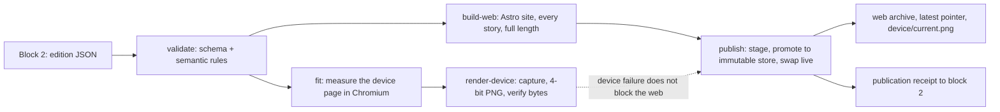

# Block 3: Broadsheet publishing architecture

Status: architecture record, 7 September 2026, revised 8 September 2026 for per-edition variation and
for making the web edition the first-class product, and rewritten 14 September 2026 to describe block
3 as built. This document records the publishing approach and the decisions behind it at the level
needed to remember the design; the [implementation plan](news-publishing-implementation-plan.md)
remains the exhaustive specification and governs contract, failure table, and protocol details.
Companions: [Block 1: ingestion architecture](news-ingestion-architecture-plan.md) and
[Block 2: editorial architecture](news-editorial-architecture-plan.md).

## Recommendation, as built

Block 3 is a **static edition publisher** in `publisher/`: TypeScript on Node, Astro for the web
edition, plain TypeScript templates for the device page, a pinned Playwright Chromium for measurement
and capture, and ImageMagick for the device image. From one accepted edition it produces two outputs.
The **web edition** is the product: a static broadsheet site carrying every story at full approved
length, with per-edition permalinks, an archive, and a latest pointer. The **device edition** is a
separate reduced artifact: one 1872 × 1404 sixteen-level grayscale PNG for a TRMNL X panel.

The two share an edition, a design language, and a component vocabulary. They do not share a layout,
a page budget, or a build path, and nothing in the web edition is constrained to keep parity with the
panel. Editions vary from day to day in composition, story counts, and callouts, and every variation
comes from block 2's editorial signals, never from randomness.

Block 3 never calls a model. It selects among the copy variants block 2 supplied and measures boxes;
it does not rewrite, shorten, reorder, or compose. Its browser loads only local pages and vendored
assets, and every contract string is escaped before it reaches a template.

## The edition is the publishing unit

The content record is the edition from block 2: ordered stories with roles, copy variants, callouts,
and complete sources. Each edition is published once into an immutable directory under `n/<id>/`
holding the edition JSON, the rendered page, the manifest with hashes, the publication receipt, and,
when it succeeded, the device page. An archived edition is never rebuilt: a correction appears in the
next edition, and a design change applies only to editions published after it. Revisions with
correction notices are designed in the [roadmap](roadmap.md) and deferred.

The web archive links every edition; a small `latest` pointer and `go/<id>/prev|next` stubs owned by
the shell mean an archived page never needs rewriting when a newer edition arrives. Every story has an
anchor, the headline links to the primary source, and the footer opens the full evidence trail: every
contributing article with its original title, publisher, and time. The coverage note and the cutoff
time are printed on the page, and the build time is never presented as the time every feed was checked.

## Design language, as built

The direction was worked out in `plans/design/` and then settled by specimen and by reading real
editions. What holds today:

- **Type.** Newsreader, a variable serif with optical sizes, for the masthead, headlines, decks,
  quotes, figures, and body; Libre Franklin, a variable grotesque, in tracked capitals for kickers,
  the dateline, source lines, and navigation. Settled 11 September 2026 after Playfair Display and
  Source Serif 4 were tried and reversed. Both faces are vendored under the OFL; no font loads from the
  network.
- **Colour.** The device is pure black on pure white with two fill greys and one hairline grey that
  land exactly on the sixteen-level palette. The web adds a warm paper tone and one dark-red accent
  for links, the pull-quote bar, and the disclosure marker. Nothing else is coloured.
- **Masthead and dateline.** Edition name and cutoff in the left ear, the edition's "Inside" line in
  the right. The dateline carries the date, the number, and the five publishers that contributed to
  the most stories with a quiet "+N more" tail, settled 14 September 2026 when sixteen titles made a
  full list crowd the masthead.
- **Story roles.** Exactly one lead: kicker, display headline, italic deck, optional callout, body with
  a drop cap in one or two columns. Secondaries with a text-face headline and a short body. Briefs
  with a headline and a one-sentence lede.
- **Attribution.** Publishers are cited, not prefixed: copy never opens with "X reports". Each story's
  footer is one quiet line naming every contributing publisher once, primary first; it is the summary
  of a disclosure that opens the full source list with the story's limitations note. Settled 11 and 14
  September 2026.
- **Body copy.** Justified, soft-hyphenated at build time so every browser breaks identically,
  paragraphs separated by a gap rather than an indent, wrapped with `text-wrap: pretty`. Settled 14
  September 2026 after an indent left one-line paragraphs looking stranded.
- **Callouts.** Five kinds, each owned by a story and written by block 2: `quote`, `figure`, `facts`,
  `box`, and `timeline`. Block 3 chooses which fit; it never composes one.
- **Web compositions.** A grid, the lead beside a rail with flowing columns below, is the default; a
  single sheet of newspaper columns is kept as a one-word switch in the title config. Both render the
  same story component and type scale. Settled 14 September 2026.
- **Device compositions.** Three were designed, lead-wide, lead-tall, and lead-centred, with empty
  bands allowed and no filler. One, lead-wide, is built: its secondary and brief bands size to their
  content and the lead takes what remains.

What never varies is type size, margins, rule weights, and palette. Variation comes only from the
composition, the counts, the callouts, and the structural elements the edition calls for.

## Layout on the device is a measured, bounded process

This governs the device edition only; the web has no page budget, no omissions, and no fit failure.

The contract's story order is authoritative. Each story declares `device_participation` of `required`,
`optional`, or `reserve`; the lead is first and required; the only role fallback is secondary to brief;
the omission and reserve lists must match those sets exactly. The publisher never invents copy, reorders
stories, or shrinks type to fit.

As built, the device lead is kicker, headline, deck, and source line, with its body read on the web.
The page is measured in the pinned Chromium and a bounded loop repairs overflow in a fixed order: drop
the tallest stories' callouts, demote secondaries that allow a brief fallback, omit optional stories
least prominent first, take the lead's short headline, then trim the tallest remaining story, until every
slot fits or a required story cannot be placed. Callouts go before stories; required stories never
vanish silently. The fitting page is captured once, converted to a 4-bit grayscale PNG with no dithering,
and verified from its bytes. The frozen composition and a fit report are stored with the edition so
block 2 can shorten copy and retry rather than guess.

## One edition, two outputs, one of them first class

A device failure of capacity or availability publishes the web edition anyway, records the cause in
the receipt, and leaves `device/current.png` pointing at the last edition that produced a page, so the
panel keeps a readable page rather than a gap. `--require-device` reverses that for callers who need
both. Integrity failures, a page that reached the network, a wrong screenshot size, an image invariant
violated, always stop the run. If the web build fails, nothing is published.

## Publication is durable without a database

Publishing writes into run-owned staging under the publish root, promotes the bundle into an immutable
store, assembles a complete release snapshot as hard links, and activates it with one atomic swap of
the `live` symlink. A durable intent is written before promotion, so `recover` can finish an
interrupted activation without rerendering, and `receipt` can reconcile a publication whose stdout was
lost. Activation records are numbered and kept forever; old releases beyond a retention count are
deleted, never the live one or the store. The store is read-only on disk, and `verify` re-hashes an
archived bundle without launching a browser. Block 2 advances its "already covered" memory only from an
activated receipt.

The published site references its assets by root-relative path, so the release directory must be
served as a web root; opening a page from the filesystem shows it unstyled.

## Rendering is local, pinned, and reproducible

Fonts, browser, and ImageMagick are pinned; `doctor` reports their identities. The render stage is
network-isolated apart from a loopback server, animations are disabled, and fonts are awaited before
measurement. Reproducibility means the same composition and environment yield stable artifacts, and
`-strip` on the ImageMagick conversion is what makes two runs byte-identical; byte identity across
operating systems or browser upgrades is not promised, and renderer upgrades get visual review.

## Delivery and hosting

Delivery starts with TRMNL's Image Display plugin fetching `device/current.png` from a host its cloud can
reach; publication and device refresh are separate events, and the page carries its own date so an
offline panel is honest. Alias, Terminus, and a private plugin remain the alternatives if conversion,
privacy, or cloud independence demand them. Hosting is a static host with authenticated reader access,
immutable asset paths, and an atomic latest pointer; the [AWS plan](aws-plan.md) maps this to S3 and
CloudFront. These plans authorise no public posting, and publisher licensing is the largest open risk.

## Decisions and the reasons behind them

- **Block 3 owns the edition schema (reversed, 8 September 2026).** The consumer that must render
  every field is the right owner; block 2 validates against block 3's published schema and rejection
  corpus.
- **The schema is hand-written JSON Schema, not generated from Zod (corrected 11 September).**
  TypeScript types are generated from it, never the reverse, so Python and TypeScript validate one
  artifact identically.
- **Astro renders the web only; the device uses plain TypeScript templates.** Astro's container
  rendering was the wrong tool for a fixed-size measured page.
- **Astro 7 and Node 26, measured on 8 September.** Versions are resolved once and pinned exactly.
- **The web edition is first class; the device is a reduced artifact.** Settled 8 September so the
  panel's compromises never reach the site.
- **Archived editions are never rebuilt; publication has durable state without a database.** Settled
  11 September: immutability as a file protocol, activation as the only evidence of publication.
- **Release-1 tests guard invariants and contracts, nothing else.** Settled 11 September to keep the
  test surface proportional to the product.
- **Type by specimen, attribution by citation, grid with a sheet switch, quiet masthead and footers,
  gap paragraphing.** The design decisions of 11 and 14 September, each recorded in the
  [decision log](decision-log.md) with what was tried and why it lost.

## Where block 3 stands

Built: `validate`, `schema`, `build-web`, `publish`, `recover`, `receipt`, `verify`, `doctor`, and
`check`, with the immutable store and release protocol, the Astro web edition in both layouts, and
vendored type. The device path, `fit` and `render-device` with the single lead-wide composition, is in
the working tree on 14 September 2026 and being finished. Three evaluation editions from 12 to 14
September were published locally that day and reviewed for visual and editorial quality, which is where
the masthead, footer, and paragraph decisions came from.

Still to do: the owner's physical device trials, which no agent can perform; the two remaining device
compositions; and the milestones the first release names, a week of consecutive editions reviewed side
by side, a correction carried in a following edition, a failed build, and an offline panel.
