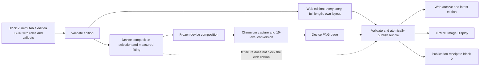

# Block 3: Broadsheet publishing architecture

Status: architecture proposal, 7 September 2026, revised 8 September 2026 twice: first for per-edition layout variation and callouts, then to make the web edition the first-class product and the device PNG a separate reduced artifact. This document recommends the publishing approach and decision boundaries; it is not a detailed implementation plan. Its companion is [Block 2: Newspaper editorial architecture](news-editorial-architecture-plan.md).

## Recommendation

Revision note, 11 September 2026: the [implementation plan](news-publishing-implementation-plan.md)
now specifies immutable numbered schemas, explicit device participation, advisory fit estimates,
and recoverable release activation. Its executable contract and failure table govern these details.

Build a **static edition publisher** using Astro, reusable HTML/CSS newspaper templates, and a pinned Playwright/Chromium renderer. It produces two outputs from one accepted edition. The **web edition** is the product: a static broadsheet site carrying the whole edition, with per-edition permalinks, an archive, and a latest pointer. The **device edition** is a separate reduced artifact: one 1872 × 1404 16-level grayscale PNG page for the TRMNL X, delivered through TRMNL's existing Image Display plugin first.

The two outputs share an edition, a design language, and a component vocabulary. They do not share a layout, a page budget, or a build path. **Nothing in the web edition is constrained to keep parity with the panel.** Where the panel forces a compromise, the compromise stays on the panel.

Editions must not look identical from day to day. Each edition has exactly one lead story, but the number of secondary and brief stories, the composition they sit in, and the callouts attached to them vary with the editorial contract from block 2. The variation is driven by editorial signals, never by randomness, so that a reader sees the emphasis an editor chose. The design direction is worked out in `plans/design/` and summarized below.

A conventional CMS is not the primary missing component. Block 2 already supplies structured, edited content; the difficult remaining work is fitting that content into readable pages consistently. Start with file-based editions and a standard static site generator. Add Keystatic as an editing interface only if manually correcting headlines, pinning stories, or adjusting sections becomes a regular task. Do not build a custom administration application.

Keep this publisher in the `copenhagen-daily` repository, in its own `publisher/` directory, alongside but independently runnable from the Python editorial application in `editorial/` and the ingestion code in `ingest/`. The TypeScript/Node toolchain is confined to `publisher/`. Its browser renders only our generated pages and local assets. No browser dependency or publisher browsing is introduced into `ingest/`; its existing restrictions remain in force.



## What to take from the visual reference

The [supplied newspaper image](https://youyesyou.me/todays_news.png), inspected on 7 September 2026, uses a large serif masthead, horizontal rules, a wide lead story, three secondary columns, a bottom strip of short briefs, compact source labels, and restrained grayscale. Its newspaper character comes mainly from hierarchy, typography, and spacing; photographs are not necessary.

Use that visual grammar as the starting point, then extend it. The reference's grey callout box in the Arctic column is the pattern to generalize: a lifted phrase, number, quote, or fact list that belongs to a story and pulls the eye to it. Do not carry its example news, date, masthead, or publisher list into generated editions as defaults. In particular, Weekendavisen appears in the reference but is not in the collector's configured scope, which covers six publishers as of 8 September 2026. Display only actual contributing publishers, with collection limitations separately available.

The TRMNL X specification is a 10.3-inch display with **1872 × 1404 pixels and 16 grayscale levels**. Start with a landscape 4:3 device profile matching the reference. Portrait can be another composition later, rather than a rotated landscape newspaper. [TRMNL X specifications](https://enterprise.trmnl.app/products/x/spec-sheet).

Design for reading at the actual physical display size. Pixel count alone does not establish legibility. Begin with large enough body copy and fewer stories, then tune on the device. A broadsheet aesthetic does not require reproducing the density of a physical broadsheet on a 10.3-inch panel.

## Design direction

The mockups in `plans/design/` (`device.html` with three compositions, `web.html`, and `README.md` with the token and element catalogue) set the direction. The essentials:

- **Type.** Playfair Display for the masthead, lead headline, pull quotes, and big figures; Source Serif 4 for everything else, including secondary headlines in bold. Small caps, not tracked capitals, for kickers, datelines, and source rows. Body copy on the device starts at 30 px with 26 px as the floor for briefs.
- **Colour.** The device edition is pure black text on pure white, with two fill greys and one hairline grey chosen to land exactly on levels of the 16-step palette. The web edition adds a warm paper tone and a single dark-red accent for links and the pull-quote bar. Nothing else is coloured.
- **Story roles.** Exactly one lead (H1) per edition: kicker, display headline, italic deck, optional callout, optional one- or two-column body with a drop cap, source row. Zero to four secondary stories (H2) per edition with a headline in the text face, short body, optional callout. Zero to eight briefs (H3) per edition: headline plus a one-line lede opening with the publisher's name.
- **Callouts.** Five kinds, each attached to a story and attributed in that story's source row: `quote` (rule at the left, display italic, speaker and reporting publisher), `figure` (one large numeral with an italic label), `facts` (two to four dashed bullets on a grey fill), `box` (a small-caps label over a bold phrase on a grey fill, the reference's pattern), and `timeline` (two to four dated rows). A callout's text is approved copy from block 2, not text the publisher composes.
- **Other elements.** Masthead ears (edition name and cutoff on the left, a short "Inside" line or weather on the right), an edition number, a fleuron between the lead and the secondary band, vertical column rules, a heavy rule above a briefs strip, and a folio with page and edition. These are structural, so they appear when the composition calls for them rather than as decoration.
- **Compositions.** Three device-only templates: *lead-wide* places a lead above secondary and brief bands; *lead-tall* gives the lead a seven-grid-column area with a two-column body and a secondary rail; *lead-centred* uses a centred lead above secondaries with a brief rail. Their maximum secondary/brief counts are 3/4, 3/0, and 4/6. All permit zero occupancy in supporting roles; empty bands disappear and sparse days retain whitespace. Original mockup counts are preferred densities, not minimum story requirements.

What varies between editions is the composition, the role counts, which stories carry callouts and of which kind, and which structural elements appear. What never varies is type size, margins, rule weights, and the palette. Variation comes from the editorial contract; the publisher does not add randomness to appear hand-made.

The shared layer is the design language, not the geometry: tokens, the type scale, rules and small caps, kickers and source rows, the story-role vocabulary, and the five callout kinds. Page templates, layout logic, and breakpoints are owned separately by each output. A small amount of duplication between a device composition and a web layout is correct; a component contorted to satisfy both is not.

## Why this stack, and where a CMS would fit

| Option | Judgment for this system |
|---|---|
| **Astro + content files + HTML/CSS + Playwright** | Recommended. Standard site routing, reusable components, a web archive, and browser rendering, with no application server needed for reading. The custom work is confined to newspaper templates and fit policy. |
| Python templates + Playwright | A credible smaller alternative for a permanently single-page product. It avoids Astro, but archive routing, content organization, and a future editing interface would need more assembly. Choose it if avoiding a Node build becomes a stronger constraint than web publishing convenience. |
| **Keystatic added to the file workflow** | Preferred optional CMS. Use it to edit configuration and explicit overrides, preserving generated editions as immutable artifacts. |
| A general hosted or self-hosted CMS | Reconsider if multiple people need a publishing workflow, roles, and editorial collaboration. It does not remove the need for custom newspaper pagination and device rendering. |
| Paged.js | Useful if the product grows into flowing long articles, print pagination, or PDF output. Fixed short-story page templates are a better initial match for this reference. |
| TRMNL Liquid templates as the main renderer | Useful for device-only dashboards, but would make web and device layouts separate publishing paths. Here the website and downloadable PNGs should remain first-class artifacts we control. |
| LLM-generated HTML or image generation per edition | Unsuitable as the production layout mechanism. Stable components provide much better control over text, attribution, links, overflow, and repeatability. |

Astro supports schema-checked content collections loaded from local JSON and other files, and static routes generated from those entries. That is sufficient content organization for immutable editions. [Astro content collections](https://docs.astro.build/en/guides/content-collections/).

Keystatic can store content locally or in GitHub and integrates with Astro, giving a path to an existing editor without introducing a separate content database. Keep any admin runtime separate from the static reader site. [Keystatic introduction](https://keystatic.com/docs/introduction).

Paged.js addresses paged media in the browser. It is an option when text must flow between pages, rather than a requirement for selecting among a few fixed newspaper compositions. This is a judgment about this product's needs, not a claim that Paged.js cannot produce newspapers. [Paged.js documentation](https://pagedjs.org/en/documentation/).

The Astro choice adds a second language and build toolchain. That is justified by the intended multi-page web product and the option of an existing CMS later. Keep templates and small build scripts straightforward; no React application or client-side state framework is needed just to read the newspaper.

## The edition, rather than an article page, is the publishing unit

The primary content record is the edition from block 2. A story may have several publisher links, and may reappear with a substantive update in a later edition. Stable edition URLs make that history understandable.

Publish an immutable directory containing the accepted edition content, a page-composition record, the device HTML and PNG, a publication manifest, and a layout report. The manifest identifies the editorial edition, layout/theme version, device profile, renderer environment, filenames, and hashes. The public content excludes the editorial profile and private audit sidecars.

The web archive links to specific editions. A small mutable `latest` pointer or redirect identifies the newest successfully published one. An archived edition's files are never replaced: a correction appears in the next edition, and a design rebuild applies only to editions published after it. Edition revisions with correction notices are designed in the [roadmap](roadmap.md) and are not part of the first release. Store generated runtime artifacts outside the source checkout; version templates, schemas, and configuration in Git without committing every PNG.

Every story has an anchor and genuine HTML source links. The headline can link to the primary reading source, with a compact source row linking all contributors. Retain original publisher titles where useful in the source details. The PNG cannot contain clickable links; its source labels and an optional edition QR code provide a route back to the linked HTML. A QR code is navigation, not an access-control mechanism.

Show the edition date, cutoff or “news through” time, page number/count, and an honest digest/coverage label. Never label the editorial build time as the time every publisher was successfully checked.

## Make layout a constrained, measured process

**This section governs the device edition only.** The web edition has no page budget, no slot capacities, no measured overflow, no omissions, and no fit failure. It renders every story and every callout the edition accepted, at full approved length, in editorial order.

For the device edition, implement the three single-page lead compositions described above. Inside-page templates remain deferred with multi-page output. Share masthead, section labels, source rows, rules, and typography tokens with the web edition.

The contract's story array defines order. Each story has `device_participation` of `required`, `optional`, or `reserve`; all are accepted web stories. Exactly one lead is first and required. The only role fallback is secondary to brief. Approved bodies, optional short headlines, and attributed callouts come from block 2. Ordered omission and reserve lists match their participation sets exactly. Presentation hints select a deterministic preference order subject to explicit substitution permission. The publisher never invents copy, reorders stories, or reduces type size to fit.

A bounded fitting policy should:

1. Choose an allowed composition accepting counts and story order. If none exists, try authorized role fallbacks and optional omissions before measurement; report capacity failure distinctly.
2. Assign stories in a stable editorial order, attach each story's first callout candidate where the slot allows one, and measure the rendered result with the actual fonts.
3. If a region overflows, drop its callout, try an approved short headline when the headline fails, then lower supplied body variants, permitted role fallback, and permitted composition alternatives.
4. Omit only candidates explicitly marked optional, in the authorized order, recording every omission. If a required story still cannot fit, fail the candidate edition and report the fit problem to block 2.

Callouts are dropped before stories. Release 1 uses a story's first callout candidate or none and does not restore dropped callouts. After a base fit, reserves are tried in declared order without altering already placed copy. The bounded greedy state machine lives in Section 10 of the implementation plan; failure is not proof that every approved arrangement was exhausted.

Do not shrink text indefinitely, clip a paragraph, or remove an attribution qualifier. Sparse news days can have fewer items and more whitespace; never invent filler to complete a visual grid.

Use maximum line counts and measured boxes as layout constraints. Word counts are useful editorial guidance, but do not predict the height of Danish compound words, long names, translated headlines, or different font metrics. Choose minimum type sizes through device trials, then treat them as hard design constraints.

Persist the final device composition with story IDs, exact approved-copy references, headline/body variants, roles, callout indices, slots, and contract/config/asset digests. Generate only the device page from that record; the web carries the whole accepted contract. Actual clipping on either axis always rejects a candidate, even if a single-column probe estimates slack. Overflow lines and character advice are nullable estimates, particularly for fragmented columns. Revalidate all regions, fonts, and isolation in the fresh screenshot context. The activated receipt, not the fit report, updates editorial publication memory.

The device edition is exactly one page in the first release. Multi-page device output, with inside-page compositions and playlist delivery, is designed in the [roadmap](roadmap.md).

## One edition, two outputs, one of them first class

**The web edition is the product.** It is a static broadsheet site built from the validated edition alone. It carries every accepted story at the longest approved body variant, every approved callout, an expandable list of every contributing article with original titles and times, the coverage note, per-story anchors, previous and next edition navigation, an archive index, and a link to the device image. It is real HTML with semantic headings, working links, selectable text, and visible keyboard focus.

Its layout is its own, chosen for a browser rather than copied from a device page. It keeps the design language — masthead, heavy and hairline rules, small caps, kickers, source rows, the type scale, and the five callout kinds — so it is recognizably the same newspaper, and it adds the warm paper tone and the single accent colour. It reflows to one column on narrow screens, preserving story order and attribution. **Do not constrain anything here for the sake of matching the panel.**

**The device edition is a separate reduced artifact.** One PNG page at exactly 1872 × 1404 pixels in 16-level grayscale, captured from a fixed-size device page: the lead, the secondaries and briefs that fit, their callouts, and the source row. No navigation, no links. Where the fit policy drops a callout or omits an optional story, that loss is the panel's alone; the web edition still carries it.

Because the web edition does not depend on the frozen device composition, a device fit failure does not block web publication. Publish the web edition, record the device failure in the receipt and the layout report, and leave the device pointer resolving to the last edition that produced a page, so the panel keeps a readable page rather than a gap. The reverse is not allowed: if the web build fails, publish nothing.

Neither output may substitute different reporting. Only the device may omit accepted copy; the web always carries the full accepted edition.

## Render locally and make the output reproducible

Render at the target dimensions and take a viewport screenshot with explicit CSS scale, without element scrolling or clipping offsets. [Playwright screenshots](https://playwright.dev/docs/screenshots).

Pin the browser, operating-system/container environment, fonts, locale, timezone behavior, and relevant rendering dependencies. Bundle licensed fonts and static assets. Wait for fonts and layout readiness before measurement and capture; disable animations and live timestamps. Use an explicit pixel scale that produces exactly 1872 × 1404 output pixels, rather than relying on the build machine's display scaling.

Make the render stage network-isolated apart from its local static server. Publisher links remain links; the browser does not visit them. Do not load remote fonts, tracking images, or scripts. Treat generated copy as escaped text, validate link schemes, and do not execute Markdown/MDX or HTML emitted by a model.

Begin with a text-led design and no remote publisher photography. A feed's image URL and credit do not by themselves establish a reuse policy. If photography becomes a desired feature, add an explicit permitted-asset path with local snapshots, attribution, and device-tested conversion. The reference shows that attractive output does not depend on this extension.

Retain a full-depth PNG master and derive the device PNG from it with ImageMagick, which is installed and verified on 8 September 2026 at version 7.1.2-31:

```sh
magick master.png -strip -colorspace Gray -depth 4 \
  -define png:color-type=0 -define png:bit-depth=4 page-1.png
```

`-depth 4` reduces to the 16 evenly spaced levels by rounding to nearest, and because the design's fills and hairlines are multiples of 0x11 they land on levels exactly; the only pixels that move are anti-aliased glyph edges, so text stays crisp. An explicit `+dither` is a verified no-op here, since `-depth 4` is a per-pixel depth reduction rather than a quantization, but dithering must never be introduced for text; it is reserved for a future photography path. `-strip` is load-bearing for reproducibility: without it ImageMagick writes `tIME` and `date:` text chunks, and two runs of the same input differ; with it they are byte-identical.

The reference image is itself a 4-bit grayscale PNG, which is the encoding to match first. Still verify palette, bit depth, orientation, cover-fit, and grayscale preservation end to end on the actual TRMNL X, because the Image Display plugin performs its own conversion.

Reproducibility means the same composition and pinned rendering environment yield stable artifacts. Do not promise byte-identical PNGs across operating systems or browser upgrades. Renderer upgrades should get visual regression checks before publishing new editions.

## Reuse TRMNL delivery before operating another server

**Start with the built-in Image Display plugin.** It accepts a hosted image URL, converts images for the device, and documents 1872 × 1404 / 4:3 for a full-screen TRMNL X image. It uses cover-fit, so mismatched aspect ratios can crop the newspaper. It also uses `ETag` and `Last-Modified` validators to detect changed images. Serve the exact device aspect ratio with correct validators at a stable current-page endpoint. [TRMNL Image Display](https://help.trmnl.com/en/articles/11479051-image-display).

One Image Display instance shows the single device page, with the edition date and edition ID visible on it. Publication and device refresh are separate events: the hosted service fetches on its own schedule. Do not cycle image content on every HTTP request: conditional requests, prefetching, and retries make that unreliable. TRMNL documents separate device and plugin refresh behavior, including next-screen requests via a button or touchbar. [TRMNL refresh behavior](https://help.trmnl.com/en/articles/10113695-how-refresh-rates-work).

Use a thin delivery adapter around page URLs and publication status so the transport can change without altering edition JSON or layout. The relevant alternatives are:

| Delivery path | When to choose it |
|---|---|
| Image Display | Default when its conversion looks good and TRMNL cloud fetching is acceptable. Lowest initial maintenance. |
| Alias plugin | If serving our already-encoded image directly is needed to preserve the appearance or support a local-network origin. Validate the exact X firmware/encoding path first. |
| TRMNL-maintained Terminus/BYOS | If cloud independence, fully controlled device delivery, or stricter edition-level page coordination becomes a requirement. Reuse this existing server rather than implementing the TRMNL device protocol. |
| Custom Liquid/private plugin | If later delivery needs dynamic data-driven screens; unnecessary just to display the PNGs already being generated. |

Alias passes an image URL to the device, but its documentation currently mixes device-specific format guidance and contains an unfinished encryption instruction. Do not base a privacy guarantee or guaranteed 16-level path on that description alone. [TRMNL Alias plugin](https://help.trmnl.com/en/articles/10701448-alias-plugin).

Terminus is TRMNL's maintained self-hosting option, and the official setup guide covers TRMNL X connection. Its availability makes it a credible fallback, not a reason to add another continuously running service immediately. [Connect to Terminus](https://help.trmnl.com/en/articles/12263392-connect-your-device-to-terminus-byos).

## Hosting, privacy, and publication failure

Choose a static host or existing reverse proxy that supports authenticated web access, immutable asset paths, correct caching, and an atomic latest-pointer update. The reader-facing HTML can be private. TRMNL Image Display needs an image origin its cloud service can reach, so browser-session authentication is not enough for that path.

For the initial cloud route, use a narrowly scoped, revocable image-access URL or supported machine authentication, and assume TRMNL receives the displayed content. Keep secrets out of HTML, edition JSON, repository files, Obsidian, and logs. An unlisted URL is a bearer capability, not the same as a user login. If that exposure is unacceptable, choose a verified local Alias route or Terminus before deployment. These plans authorize no public posting or account configuration.

Build and validate in per-run staging. Follow the implementation plan's durable intent, immutable store promotion, complete release snapshot, and atomic `live` symlink activation protocol. Each release owns its index snapshot; retain activation records after release cleanup. `recover` completes interrupted activation without rerendering; `receipt` reconciles a lost response. Hash the stored receipt in the manifest and return the manifest digest only in the outer CLI response, avoiding a hash cycle. Block 2 updates memory once from an activated result, never from a merely stored bundle. Local activation, hosting, device delivery, and reading remain distinct events.

Device capacity or availability failures permit independently validated web-only publication by default; retain the prior device image, or omit its route if none exists. `--require-device` blocks activation and preserves the original cause. Integrity/isolation failures or an invalid web output block activation. Successful fitting alone never authorizes a device link: capture and conversion must pass. Backdated editions enter the archive without moving latest pointers backward. After a live swap, recovery reconciles uncertain acknowledgment; cleanup failures are warnings, not a false claim of non-publication. Hosting/upload failures are separate future delivery concerns. A device can remain offline with its last image, so every page carries an honest date; stale-screen alerts belong in operations.

Human overrides are not part of the first release; they arrive with edition revisions, per the [roadmap](roadmap.md). Whenever they arrive, a CMS must not rewrite generated JSON in place or become a second, conflicting source of truth.

## What to prove before expanding the product

The first milestone is one real edition rendered as a web edition and a device PNG, compared against the reference at the actual TRMNL X size. Follow it with dense, sparse, long-headline, Danish-text, missing-description, and partial-coverage examples, and with a week of consecutive editions reviewed side by side to confirm they differ in composition, counts, and callouts without the type or rules changing. Verify the exact image displayed on the device, not just the browser preview, and check that each callout kind survives 16-level quantization legibly.

Next exercise a correction carried in the following edition, cached refresh, a failed build, and an offline device. Confirm required stories never vanish, qualifiers survive shorter variants, source links match the accepted evidence, and publication receipts describe the actual output.

Only add a CMS when repeated manual editing demonstrates its value. Add Paged.js when flowing article-length text or print/PDF requirements justify it. Add BYOS when transport or privacy requirements justify the operational cost. The first product needs reliable templates, measured fit, and repeatable delivery; these decisions leave those extensions available without requiring them now.
